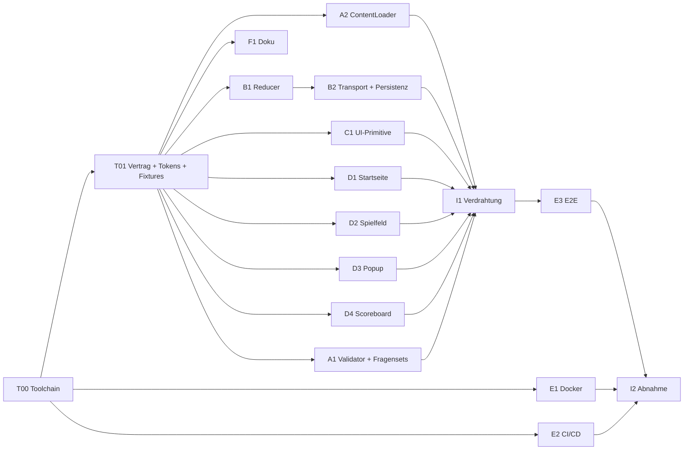

# Arbeitsplan & Subtasks – Web-Jeopardy

Begleitdokument zum [Technischen Konzept](./technisches-konzept.md). Ziel dieses Dokuments: das Vorhaben so schneiden, dass **mehrere Personen (oder Agenten) gleichzeitig** arbeiten können, ohne sich gegenseitig zu blockieren – plus verbindliche Regeln zu Commits und Arbeitsweise.

---

## Inhalt

1. [Prinzip der Parallelisierung](#1-prinzip-der-parallelisierung)
2. [Phase 0 – Fundament (blockierend)](#2-phase-0--fundament-blockierend)
3. [Parallele Streams A–F](#3-parallele-streams-af)
4. [Integration & Abnahme](#4-integration--abnahme)
5. [Abhängigkeitsgraph & Meilensteine](#5-abhängigkeitsgraph--meilensteine)
6. [Commit-Regeln (verbindlich)](#6-commit-regeln-verbindlich)
7. [Best Practices (verbindlich)](#7-best-practices-verbindlich)
8. [Definition of Ready / Definition of Done](#8-definition-of-ready--definition-of-done)
9. [Abnahmematrix gegen `details.md`](#9-abnahmematrix-gegen-detailsmd)
10. [Backlog & Phase 2](#10-backlog--phase-2)

---

## 1. Prinzip der Parallelisierung

Parallelarbeit funktioniert nur, wenn die **Schnittstellen vor der Implementierung feststehen**. Deshalb:

1. **Phase 0 liefert alle Verträge** – TypeScript-Typen, Zod-Schemas, Design-Tokens, Signaturen der UI-Primitive und Test-Fixtures. Phase 0 ist bewusst klein (½–1 Personentag) und wird von **einer** Person erledigt.
2. Danach arbeiten alle Streams **gegen Verträge und Fixtures**, nicht gegeneinander: Das Board-Team braucht weder den Content-Loader noch echte Fragensets, das Logik-Team braucht keine UI.
3. **Ein Task = ein Branch = ein PR = ein klar abgegrenzter Ordner.** Die Ordnerzuordnung (Spalte „Dateihoheit") minimiert Merge-Konflikte fast vollständig.
4. Querschnittsdateien (`tokens.css`, `types.ts`, `routes.tsx`) haben genau **einen** Eigentümer-Task; alle anderen lesen sie nur.

---

## 2. Phase 0 – Fundament (blockierend)

> Muss **vor** allen anderen Tasks gemergt sein. Danach ist die Parallelarbeit freigegeben.

### T00 – Repository, Toolchain, CI-Skelett
**Dateihoheit:** Repo-Wurzel, `.github/`, Konfigurationsdateien
**Aufwand:** ~0,5 PT

- pnpm-Workspaces (`corepack enable`), `.nvmrc` (Node LTS), `pnpm-workspace.yaml`
- `apps/web` (Vite + React + TypeScript strict), `packages/game-core`
- ESLint (flat config, `@typescript-eslint`, `react-hooks`, `jsx-a11y`), Prettier, Stylelint-Regel „keine rohen Hex-Farben in `src/**`"
- Vitest-Setup, `husky` + `lint-staged` + `commitlint` (Conventional Commits)
- npm-Skripte: `dev`, `build`, `preview`, `lint`, `typecheck`, `test`, `test:e2e`, `validate:content`
- GitHub-Actions-Workflow (Skelett): install → lint → typecheck → test → build
- `README.md` mit Quickstart, `.gitignore`, `.editorconfig`, `LICENSE`

**DoD:** `pnpm install && pnpm lint && pnpm typecheck && pnpm test && pnpm build` läuft lokal und in CI grün; ein Commit mit falschem Format wird vom Hook abgelehnt.

### T01 – Schnittstellen-Vertrag, Tokens, Fixtures
**Dateihoheit:** `packages/game-core/src/types.ts`, `schema.ts`, `fixtures.ts`; `apps/web/src/styles/tokens.css`; `apps/web/src/components/ui/*.tsx` (nur Signaturen)
**Abhängig von:** T00 · **Aufwand:** ~0,5 PT

- Alle Typen aus [Kap. 6 des Konzepts](./technisches-konzept.md#6-schnittstellen-vertrag-basis-für-parallelisierung) – zunächst mit `throw new Error('not implemented')`-Rümpfen für Reducer/Selektoren
- Zod-Schemas `gameDefinitionSchema`, `topicIndexSchema` (Regeln aus Konzept Kap. 5.1)
- `fixtures.ts`: ein vollständiges, gültiges 5×5-Fragenset + ein State-Fixture „Spiel mitten im Verlauf" + bewusst ungültige JSONs für Negativtests
- `tokens.css` exakt wie im Konzept Kap. 8.1
- **Signaturen** (Props-Interfaces) der UI-Primitive `Card`, `Button`, `Modal`, `TextField`, `SegmentedControl` – Implementierung folgt in C1, die Screen-Teams können sofort dagegen bauen
- `i18n/de.ts` mit allen Textkonstanten; Buttonbeschriftungen als **Funktionen** statt Konstanten (`scoreCorrect: (name: string) => \`${name} richtig\``, `scoreWrong: (name: string) => \`${name} falsch\``) – so gilt eine Regel für beliebig viele Teams
- `createDefaultTeams(count)` (Namen „Team A", „Team B", …) und `MAX_TEAMS_UI = 8`

**DoD:** `pnpm typecheck` grün; alle Fixtures validieren gegen die Schemas (bzw. Negativfälle schlagen erwartungsgemäß fehl); Vertrag als ADR `docs/adr/0001-schnittstellen-vertrag.md` dokumentiert.

---

## 3. Parallele Streams A–F

Alle folgenden Tasks starten **gleichzeitig** nach Phase 0. Innerhalb eines Streams ist die Reihenfolge sequenziell, zwischen Streams gibt es keine Blockaden.

### Stream A – Inhalte & Laden

| ID | Task | Dateihoheit | Abh. | Aufwand |
|---|---|---|---|---|
| **A1** | **Content-Validator & Fragensets**: CLI `scripts/validate-content.ts` (validiert alle `content/topics/*.json` + Index-Konsistenz, Exit-Code ≠ 0 bei Fehler, feldgenaue Meldungen); **3 vollständige Fragensets** à 25 Fragen + `index.json`; Autorenleitfaden `content/README.md` | `content/`, `scripts/` | T01 | 1,5 PT |
| **A2** | **ContentLoader**: `fetchTopicIndex()`, `fetchTopic(id)` (lazy), `parseUploadedFile(File)`; Zod-Validierung mit lesbarer Fehleraufbereitung; Lade-/Fehler-/Leer-Zustände als typisierte Rückgabe; Unit-Tests mit gemocktem `fetch` | `apps/web/src/content/` | T01 | 1 PT |

### Stream B – Spiellogik (kein UI-Bezug)

| ID | Task | Dateihoheit | Abh. | Aufwand |
|---|---|---|---|---|
| **B1** | **Reducer & Selektoren**: vollständige Implementierung aller Actions; Selektoren inkl. schrittweiser Punkte-Klammerung, `selectRanking` (Gleichstand), `selectIsPracticeMode`, `selectTeamStats`, `createDefaultTeams`; Unit-Tests für **alle 6 Invarianten** aus Konzept Kap. 7, **jeweils mit n = 1, 2 und 5 Teams**; Coverage ≥ 90 % | `packages/game-core/src/reducer.ts`, `selectors.ts`, Tests | T01 | 1,5 PT |
| **B2** | **Transport & Persistenz**: `createLocalTransport()` gemäß `GameTransport`; Store-Binding via `useSyncExternalStore`; localStorage-Autosave (debounced) + validiertes Wiederherstellen + „Spiel fortsetzen?"-Datenpfad; Tests inkl. defektem/veraltetem Storage-Eintrag | `apps/web/src/state/` | T01, B1 | 1 PT |

### Stream C – Design-System

| ID | Task | Dateihoheit | Abh. | Aufwand |
|---|---|---|---|---|
| **C1** | **UI-Primitive**: `Card`, `Button` (Varianten `primary`/`ghost`/`success`/`danger`), `Modal` (natives `<dialog>`, ESC/Backdrop, `aria-labelledby`), `TextField`, `SegmentedControl`, `AppShell`; Tailwind-Theme aus den Tokens; Fokus-Styles; `prefers-reduced-motion`; kleine Demo-Seite `/__ui` (nur Dev-Build) | `apps/web/src/components/ui/`, Tailwind-Config | T01 | 1,5 PT |

> **Hinweis zur Reihenfolge:** C1 sollte als **erster** Stream-Task gemergt werden (Zielzeitpunkt Tag 1–2), da die Screen-Tasks danach ihre lokalen Stubs entfernen. Die Props-Signaturen aus T01 stellen sicher, dass dieses Entfernen ein reines Löschen ist, keine Umbauarbeit.

### Stream D – Screens (die vier UI-Pakete, vollständig parallel)

| ID | Task | Dateihoheit | Abh. | Aufwand |
|---|---|---|---|---|
| **D1** | **Startseite**: **dynamische Teamliste** (hinzufügen/entfernen, Minimum 1, UI-Maximum `MAX_TEAMS_UI`), Namensfelder mit Defaults „Team A/B/C/…", **Übungsmodus-Hinweis bei genau einem Team**, Themenauswahl aus Index, JSON-Upload-Feld, Validierung, „Spiel starten" (deaktiviert ohne Thema), „Laufendes Spiel fortsetzen?"-Karte; Komponententests inkl. n = 1 und n = `MAX_TEAMS_UI` | `apps/web/src/features/setup/` | T01 (+C1, A2 zum Verdrahten) | 1,5 PT |
| **D2** | **Spielfeld**: 5×5-Grid, Kategorie-Header in Palettenfarbe, Punktekarten, Zustände normal/hover/fokussiert/**gewertet-grau**, Beamer-Skalierung (kein Scrollen ≥ 1280×720), Tastaturbedienung; Test: *Öffnen ohne Wertung graut die Karte nicht* | `apps/web/src/features/board/` | T01 (+C1) | 1,5 PT |
| **D3** | **Frage-Popup**: Stufe 1 (Kategorie, Punkte, Frage, „Antwort anzeigen"), Stufe 2 (Musterlösung + Punktebuttons, vorher **nicht im DOM**), **Buttons aus `state.teams` generiert** (`{Teamname} richtig` / `{Teamname} falsch`, 2 × n), umbrechendes `auto-fit`-Layout, Wertung schließt Popup, Schließen ohne Wertung wertet nicht; Tests für beide Stufen und für **n = 1, 2, 8** (bei n = 2 exakte Beschriftungsprüfung) | `apps/web/src/features/clue/` | T01 (+C1) | 1,5 PT |
| **D4** | **Scoreboard & Endstand**: Teamleiste als `auto-fit`-Grid mit **direkt editierbaren** Namen (→ `team/rename`, Buttonbeschriftungen folgen sofort), Punktestände mit `aria-live`, „Neues Spiel" mit Rückfrage, Endstand-Overlay: **Ranking mit Gleichstandsbehandlung bei n ≥ 2, Trefferquote statt Sieger bei n = 1 (Übungsmodus)** | `apps/web/src/features/scoreboard/` | T01 (+C1) | 1 PT |

### Stream E – Infrastruktur

| ID | Task | Dateihoheit | Abh. | Aufwand |
|---|---|---|---|---|
| **E1** | **Docker**: Multi-Stage-Dockerfile, `nginx.conf` (SPA-Fallback, Caching-Regeln, `no-cache` für `index.html` und `/topics/*`), `docker-compose.yml` mit Topics-Volume, Entrypoint für `/config.json`, `.dockerignore`, Healthcheck, Doku im README | `docker/` | T00 | 1 PT |
| **E2** | **CI/CD-Ausbau**: Jobs lint/typecheck/unit/content/build/docker-build/E2E, Caching, Artefakt-Upload (`dist`), Branch-Protection-Empfehlung, optional Image-Push in eine Registry | `.github/workflows/` | T00 | 0,5 PT |
| **E3** | **E2E-Tests**: Playwright-Setup + Happy Path (n = 2) + Solo-Durchlauf (n = 1) + die **sechs** verbindlichen Regressionstests (Konzept Kap. 13) + `@axe-core/playwright`-Checks | `e2e/` | I1 | 1 PT |

### Stream F – Dokumentation

| ID | Task | Dateihoheit | Abh. | Aufwand |
|---|---|---|---|---|
| **F1** | **Doku**: README (Setup, Skripte, Docker-Betrieb, eigenes Fragenset anlegen), ADRs 0001–0004 (Vertrag, Stack, Transport-Naht, Docker), Screenshots, `CONTRIBUTING.md` mit den Regeln aus Kap. 6/7 dieses Dokuments | `docs/`, `README.md` | laufend | 0,5 PT |

---

## 4. Integration & Abnahme

| ID | Task | Inhalt | Abh. | Aufwand |
|---|---|---|---|---|
| **I1** | **Verdrahtung** | Routing `/` ↔ `/game`, Store-Provider, ContentLoader an Startseite, Transport an alle Features, Error Boundary, Entfernen aller Stubs/Fixtures aus dem Produktivpfad | A2, B2, C1, D1–D4 | 1 PT |
| **I2** | **Abnahme & Politur** | Durchlauf der [Abnahmematrix](#9-abnahmematrix-gegen-detailsmd), Beamer-Test 1280×720 und 1920×1080, Kontrast-/Tastaturcheck, Performance-Budget, Bugfix-Runde | I1, E3 | 1 PT |

---

## 5. Abhängigkeitsgraph & Meilensteine



**Aufwand gesamt:** ~18 Personentage.

| Meilenstein | Inhalt | Kalenderzeit bei 4 parallelen Bearbeitern |
|---|---|---|
| **M0 – Fundament steht** | T00, T01 gemergt, Parallelarbeit freigegeben | Tag 1 |
| **M1 – Bausteine fertig** | C1, B1, B2, A1, A2, D1–D4, E1, E2 gemergt | Tag 2–5 |
| **M2 – Spielbar** | I1 verdrahtet, Happy Path lokal durchspielbar | Tag 6 |
| **M3 – Auslieferbar** | E3 grün, I2 abgenommen, Docker-Image gebaut | Tag 7 |

**Empfohlene Zuteilung bei vier Bearbeitern:**
① C1 → D2 → D3 · ② B1 → B2 → I1 · ③ A1 → A2 → D1 · ④ E1 → E2 → D4 → E3

---

## 6. Commit-Regeln (verbindlich)

**Regelmäßig, klein und immer grün committen** – das ist bei paralleler Arbeit kein Stilthema, sondern die Voraussetzung dafür, dass Merges billig bleiben.

### Kadenz

- **Mindestens ein Commit pro abgeschlossenem logischem Schritt** – z. B. „Schema geschrieben", „Test rot → grün", „Komponente rendert".
- **Spätestens alle 60–90 Minuten** Arbeitszeit ein Commit; nie länger als einen halben Tag uncommitted arbeiten.
- **Täglich mindestens einmal pushen** – kein Code, der nur lokal existiert.
- Faustregel Größe: **≤ ~200 geänderte Zeilen** pro Commit, **≤ 400** pro PR. Größere Pakete werden aufgeteilt (z. B. „Struktur + Tests" und „Implementierung").
- **Jeder Commit auf einem Branch muss für sich baubar sein** (`lint`, `typecheck`, `test` grün). Kein „repariere ich später"-Commit; kein defekter `main`.

### Format – Conventional Commits (per `commitlint` erzwungen)

```
<typ>(<scope>): <imperative Kurzbeschreibung, klein, ohne Punkt>

[optionaler Body: Warum, nicht Was]
[optional: Refs T-ID]
```

- **Typen:** `feat`, `fix`, `refactor`, `test`, `docs`, `style`, `build`, `ci`, `chore`, `perf`
- **Scopes:** `core`, `web`, `content`, `ui`, `docker`, `ci`, `docs`
- Beispiele:
  `feat(core): punkte-selektor mit schrittweiser klammerung auf null`
  `feat(web): frage-popup zeigt antwort erst nach klick`
  `test(core): invariante – öffnen einer karte erzeugt kein score-event`
  `fix(ui): fokusring auf gewerteten karten entfernen`

### Branches & Merges

- Branch je Task: `feat/D3-frage-popup`, `chore/T00-toolchain` – **Lebensdauer max. 2 Tage**.
- Kein direkter Push auf `main`; Änderungen ausschließlich per PR.
- **Squash-Merge** nach `main`, PR-Titel im Conventional-Commit-Format → sauberer, linearer Verlauf.
- Vor dem Merge auf aktuellen `main` rebasen; Konflikte löst der PR-Autor.
- PR-Beschreibung nennt: Task-ID, was geprüft wurde, Screenshots bei UI-Änderungen.

### Automatische Absicherung

| Hook / Gate | Prüfung |
|---|---|
| `pre-commit` (lint-staged) | Prettier, `eslint --max-warnings=0` auf geänderte Dateien, `validate:content` bei Änderungen in `content/**` |
| `commit-msg` | commitlint (Conventional Commits) |
| `pre-push` | `tsc --noEmit` + betroffene Vitest-Tests |
| CI (PR) | install → lint → typecheck → unit → content → build → docker build → E2E |

---

## 7. Best Practices (verbindlich)

### Code

- **TypeScript strict**, kein `any` (bei Bedarf `unknown` + Narrowing), keine `@ts-ignore` ohne begründenden Kommentar.
- **`game-core` bleibt rein:** keine React-, DOM- oder Browser-APIs, keine `Date.now()`/`Math.random()` im Reducer – Zeit und IDs kommen über die Action (Voraussetzung für Multiplayer und deterministische Tests).
- **Komponenten sind präsentativ:** Zustandsänderungen ausschließlich per `dispatch(action)`, keine Geschäftslogik in JSX.
- **Keine rohen Farbwerte** in Komponenten – nur Tokens aus `tokens.css` (Lint-Guard aktiv). Keine externen Schriften, kein `@font-face`, keine Icon-Webfonts.
- **Keine externen Laufzeit-Requests** (keine CDNs, keine Analytics) – die App muss offline und im geschlossenen Netz funktionieren.
- Benannte Exporte, Dateien möglichst < 250 Zeilen, ein Feature pro Ordner, keine zirkulären Importe.
- Sichtbare Texte ausschließlich aus `i18n/de.ts` – keine Strings im JSX.
- Abhängigkeiten sparsam: neue Runtime-Dependency nur mit kurzer Begründung im PR.

### Tests

- **Test-First bei der Kernlogik:** Für die Invarianten aus Konzept Kap. 7 wird der Test vor der Implementierung geschrieben.
- Jeder Bugfix bekommt zuerst einen fehlschlagenden Regressionstest.
- Testnamen beschreiben Verhalten in Fachsprache („karte bleibt farbig, wenn das popup ohne wertung geschlossen wird").
- Komponententests über Rolle/Text (`getByRole('button', { name: 'Team A richtig' })`), nicht über CSS-Klassen.
- Die sechs Kernregeln aus der Abnahmematrix sind dauerhaft durch E2E-Tests abgedeckt und dürfen nicht entfernt werden.
- **Keine Annahme über die Teamanzahl** – weder im Code noch in Tests. Wo etwas pro Team gerendert oder berechnet wird, gibt es mindestens einen Test mit n = 1 und einen mit n > 2.

### Zusammenarbeit

- **Dateihoheit respektieren:** fremde Task-Ordner nicht „im Vorbeigehen" anpassen – stattdessen kurze Abstimmung oder Folge-Issue.
- **Vertragsänderungen** (`types.ts`, `tokens.css`) nur per eigenem PR mit Review durch mindestens zwei Streams und Update der ADR.
- **WIP-Limit 1:** eine Person bearbeitet einen Task zu Ende, bevor sie den nächsten anfängt.
- Architekturentscheidungen als **ADR** in `docs/adr/` festhalten (Kontext, Entscheidung, Konsequenzen).
- Reviews innerhalb von 24 h; Review-Fokus: Vertragstreue, Tests, Barrierefreiheit, keine Design-Abweichungen.
- Konzept und Arbeitsplan sind lebende Dokumente – Abweichungen werden **dort** nachgezogen, nicht mündlich vereinbart.

---

## 8. Definition of Ready / Definition of Done

**Ready (Task darf starten):** Abhängigkeiten gemergt · Dateihoheit geklärt · Akzeptanzkriterien im Task notiert · benötigte Fixtures vorhanden.

**Done (Task darf gemergt werden):**

- [ ] Akzeptanzkriterien erfüllt, an Fixtures **und** an einem echten Fragenset geprüft
- [ ] `pnpm lint && pnpm typecheck && pnpm test && pnpm build` lokal grün, CI grün
- [ ] Tests ergänzt (Unit und/oder Komponente); `game-core`-Coverage ≥ 90 % gehalten
- [ ] Tastaturbedienung und Fokus geprüft, keine Kontrastverletzung
- [ ] Keine `TODO`s ohne Issue-Referenz, kein toter Code, keine auskommentierten Blöcke
- [ ] Conventional Commits eingehalten, Branch rebased, PR ≤ 400 Zeilen
- [ ] Doku/README/ADR bei Bedarf aktualisiert

---

## 9. Abnahmematrix gegen `details.md`

Jede Vorgabe wird beim Abschluss (I2) einzeln abgehakt – Nachweis in Klammern.

| # | Vorgabe aus `details.md` | Nachweis | Task |
|---|---|---|---|
| 1 | Hintergrund `#10141F` | Token `--color-bg`, visuelle Prüfung | T01, C1 |
| 2 | Kartenoptik, abgerundete Ecken | `Card`-Primitive, überall verwendet | C1 |
| 3 | Keine externen Schriften (nur `system-ui`/Arial) | Netzwerk-Panel zeigt keine Font-Requests; Lint-Guard | C1, I2 |
| 4 | Kategoriefarben exakt die fünf Hex-Werte | `CategoryColor`-Typ + Zod-Enum + Palette per Index | T01, D2 |
| 5 | 5×5-Grid mit Kategorie-Headern oben | Board-Layout, Schema erzwingt 5×5 | A1, D2 |
| 6 | Karten werden **erst nach Punktebutton** grau | E2E `karte-bleibt-farbig-nach-oeffnen-ohne-wertung` | B1, D2, E3 |
| 7 | Popup zeigt Kategorie, Punktzahl, Frage | Komponententest D3 | D3 |
| 8 | Musterlösung **und** vier Punktebuttons erst nach „Antwort anzeigen" | E2E `antwort-und-buttons-erst-nach-reveal` (Elemente vorher nicht im DOM) | D3, E3 |
| 9 | Buttons „Team A richtig / Team A falsch / Team B richtig / Team B falsch" | E2E `beschriftung-team-a-b-richtig-falsch` prüft die exakte Beschriftung bei der Default-Konfiguration (n = 2) | D3, E3 |
| 9a | Beschriftungsregel gilt für **beliebig viele Teams** | Buttons werden aus `state.teams` generiert; Test mit n = 1, 2, 8 → immer 2 × n Buttons `{Name} richtig` / `{Name} falsch` | D3, E3 |
| 9b | **Übungsmodus mit einem Team** | E2E `uebungsmodus-mit-einem-team`: Start mit n = 1, zwei Buttons, Punkte werden addiert/abgezogen, Endstand zeigt Trefferquote statt Sieger | D1, D3, D4, E3 |
| 10 | Punkte addieren/abziehen, **nie unter 0** | Unit-Test Klammerung + E2E `punktestand-faellt-nicht-unter-null` | B1, E3 |
| 11 | Teamnamen oben direkt editierbar | Komponententest D4 (Rename → Buttonbeschriftung folgt sofort, auch im Übungsmodus) | D4 |
| 12 | Fragen/Spielfeld zu Spielbeginn ladbar | Themenauswahl + Lazy-Load + Upload | A2, D1 |
| 13 | JSON-Grundkonzept für Fragensets | Schema + Validator + Autorenleitfaden | A1, T01 |
| 14 | Startseite: Teamanzahl, Teamnamen, Themenwahl | Komponententests D1 (Teams hinzufügen/entfernen, Minimum 1, UI-Maximum) | D1 |
| 15 | Modernes CSS-/JS-Framework | React + Vite + Tailwind (ADR 0002) | T00, F1 |
| 16 | Multiplayer später integrierbar | Action-/Transport-Naht + reiner Core (ADR 0003) | B1, B2 |
| 17 | `dist` läuft im Docker-Container | `docker compose up` → Spiel unter `:8080` | E1 |

---

## 10. Backlog & Phase 2

**Backlog (nach MVP, klein):**
`BL-1` Mehrfachwertung derselben Frage (mehrere Teams pro Clue) · `BL-2` „Wertung rückgängig" (Event-Log unterstützt es bereits) · `BL-3` Moderator-Shortcuts (Leertaste/1–4) · `BL-4` Medien (Bild/Audio) in Clues · `BL-5` Daily Double & Final Jeopardy · `BL-6` Timer je Frage · `BL-7` Fragenset-Editor im Browser · `BL-8` Sound-Effekte.

**Phase 2 – Multiplayer (eigene Planung, Schnitt bereits vorgesehen):**

| ID | Task |
|---|---|
| P2-1 | Spike: Räume, Rollen, Reconnect-Verhalten (Ergebnis als ADR) |
| P2-2 | `apps/server`: Fastify + `ws`, Raumverwaltung mit Code, autoritativer State über denselben `gameReducer` |
| P2-3 | `createWebSocketTransport()` im Client (UI bleibt unverändert) |
| P2-4 | Getrennte Ansichten: Moderator (`/host/:code`) vs. Spieler (`/join/:code`) inkl. Buzzer |
| P2-5 | Docker-Compose um `server` + Reverse-Proxy für `/ws` erweitern, Lasttest |
