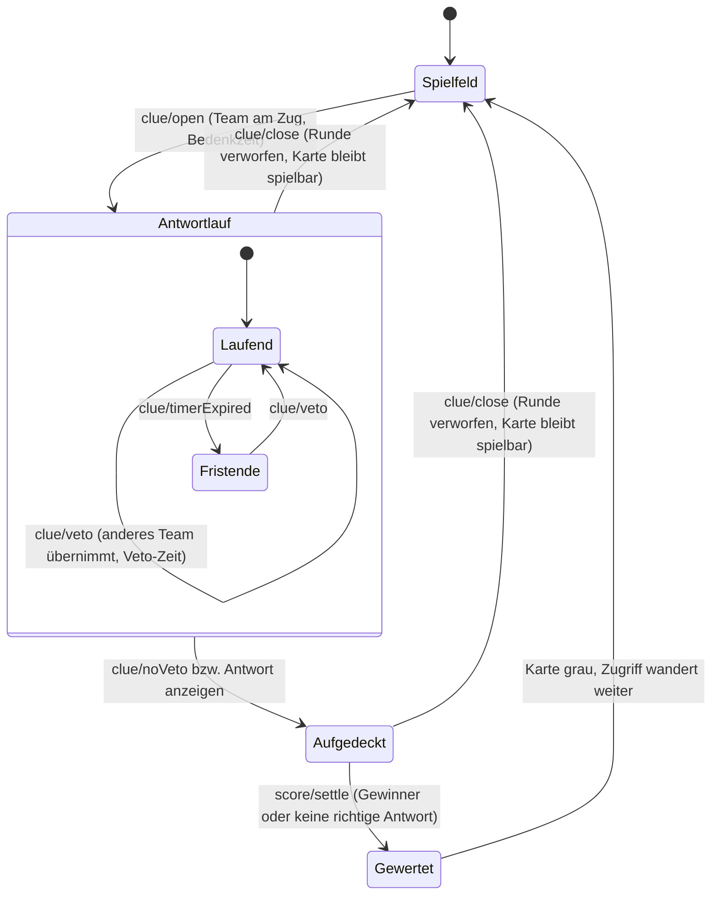

# Konzept – Veto-Runde

Status: abgestimmt, bereit zur Umsetzung · Datum: 2026-08-16 · Grundlage:
`kontext/veto-funktion/` (Beschreibung und Mockup) sowie zwei Abstimmungsrunden ·
Bezug: [Technisches Konzept](./technisches-konzept.md), [Arbeitsplan](./arbeitsplan.md)

---

## Inhalt

1. [Ziel und Kurzfassung](#1-ziel-und-kurzfassung)
2. [Ablauf](#2-ablauf)
3. [Zustandsautomat](#3-zustandsautomat)
4. [Regeln und Eventualitäten](#4-regeln-und-eventualitäten)
5. [Auswirkungen auf Bestehendes](#5-auswirkungen-auf-bestehendes)
6. [Datenmodell und Vertrag](#6-datenmodell-und-vertrag)
7. [Oberfläche](#7-oberfläche)
8. [Einstellungen und Teilen-Link](#8-einstellungen-und-teilen-link)
9. [Barrierefreiheit und Beamer](#9-barrierefreiheit-und-beamer)
10. [Teststrategie](#10-teststrategie)
11. [Persistenz und Migration](#11-persistenz-und-migration)
12. [Arbeitsschnitt](#12-arbeitsschnitt)
13. [Entscheidungsverlauf](#13-entscheidungsverlauf)
14. [Offene Detailfrage](#14-offene-detailfrage)
15. [Nicht Teil dieses Konzepts](#15-nicht-teil-dieses-konzepts)

---

## 1. Ziel und Kurzfassung

Bisher gehört eine Frage genau einem Team: Wer am Zug ist, antwortet, und die Wertung trifft
nur dieses Team. Künftig ist jede Frage für alle offen: **Meldet sich ein anderes Team per
Veto, übernimmt es.** Am Ende entscheidet die Moderation, welches der beteiligten Teams
richtig lag; die übrigen Beteiligten gehen leer aus oder verlieren Punkte – je nach der
bereits vorhandenen Abzugsregel.

In einem Satz: aus „ein Team pro Frage" wird „ein Team gewinnt die Frage, mehrere versuchen
sich daran".

**Die Veto-Runde ist keine Option, sondern der Spielmodus.** Es gibt keinen Betrieb mehr ohne
sie. Was das für die ursprüngliche Anforderung bedeutet, steht in
[Kapitel 5.2](#52-die-vier-punkteknöpfe-entfallen).

---

## 2. Ablauf

1. Eine Karte wird geöffnet. Das Team am Zug (bisherige Reihum-Logik) beginnt; seine
   Bedenkzeit läuft, sofern eine eingestellt ist. **Dieses Team antwortet zwingend** – es gibt
   keinen Zustand „hat nichts gesagt".
2. Im Popup stehen ab dem ersten Moment **ein Knopf je noch nicht beteiligtem Team** („Veto:
   Blaue Zwerge") sowie **„Kein Veto"**.
3. Meldet sich ein Team, drückt die Moderation dessen Knopf. Damit ist dieses Team am Zug, die
   **Veto-Zeit** beginnt, und das Team zählt als beteiligt.
4. Das wiederholt sich, bis entweder **„Kein Veto"** gedrückt wird oder **kein Team mehr
   übrig** ist – die Vetos können sich also vollständig erschöpfen.
5. Aufgedeckt wird immer per Klick: „Kein Veto" bzw., wenn keine Kandidaten mehr da sind,
   „Antwort anzeigen". Auch nach abgelaufener Zeit deckt die Oberfläche nichts von selbst auf;
   die Moderation trifft die Entscheidung.
6. In der Wertung wählt die Moderation, **welches beteiligte Team richtig lag**. Dieses Team
   erhält die Punkte, alle übrigen Beteiligten 0 Punkte oder −Punktzahl (je nach Abzugsregel).
   Unbeteiligte Teams bleiben unberührt.
7. Lag niemand richtig, gibt es **„Keine richtige Antwort gegeben"** – dann werden alle
   Beteiligten als falsch gewertet.

### Zuordnung zum Mockup

`kontext/veto-funktion/veto-funktion.png` zeigt Schritt 2: Kategorie und Punktzahl in der
Kopfzeile, darunter Frage, Countdown, Veto-Knöpfe und „Kein Veto". Diese Reihenfolge bleibt;
die Knöpfe tragen statt „Veto 1 / Veto 2" die **echten Teamnamen**.

---

## 3. Zustandsautomat



Drei Eigenschaften sind daran wesentlich:

- **Der Antwortlauf ist eine Schleife,** keine feste Reihenfolge. Wer als Nächstes antwortet,
  bestimmt die Moderation, nicht der Index im Team-Array.
- **Jeder Übergang geht von einem Klick aus.** Kein automatisches Weiterrücken, kein
  automatisches Aufdecken – auch nicht nach Fristablauf.
- **Gewertet wird genau einmal,** am Ende, für alle Beteiligten gemeinsam.

---

## 4. Regeln und Eventualitäten

### 4.1 Veto-Knöpfe

Sie erscheinen **sofort mit dem Öffnen der Karte**, zusammen mit dem Countdown. Das erspart
einen Knopf „hat geantwortet" und erlaubt es der Moderation, auch auf einen Zwischenruf vor
der eigentlichen Antwort zu reagieren.

### 4.2 Wer darf ein Veto einlegen?

Jedes Team, das bei **dieser Frage** noch nicht am Zug war: **eine Antwort je Team und
Frage.** Beteiligte verschwinden aus der Knopfliste. Sind alle durch, entfällt die
Veto-Auswahl und es bleibt „Antwort anzeigen".

### 4.3 Ablauf der Zeit

Die Zeit endet, der Countdown zeigt „Zeit abgelaufen" – und sonst geschieht nichts. **Die
Moderation muss eine der Veto-Entscheidungen treffen:** ein Team übernehmen lassen oder
aufdecken. Das gilt gleichermaßen für das erste Team und für jedes übernehmende.

### 4.4 Wertung

| Wahl der Moderation                             | Wirkung                                                                                                          |
| ----------------------------------------------- | ---------------------------------------------------------------------------------------------------------------- |
| **„<Team> richtig"** (ein Knopf je Beteiligtem) | Dieses Team erhält die volle Punktzahl. Alle anderen Beteiligten: 0 Punkte oder −Punktzahl, je nach Abzugsregel. |
| **„Keine richtige Antwort gegeben"**            | Alle Beteiligten werden als falsch gewertet (0 oder −Punktzahl).                                                 |

**Teams, die nicht mitgespielt haben, bleiben in jedem Fall außen vor** – sie erscheinen weder
als Knopf noch werden sie belastet. Ein unbeteiligtes Team lässt sich auch nicht nachträglich
als Gewinner eintragen; das würde genau die Trennung aufweichen, die diese Regel schafft.

Der Punktestand bleibt wie bisher bei null geklammert, und zwar je Wertung einzeln.

### 4.5 Fehlbedienung

| Situation                               | Verhalten                                                                                                                                                    |
| --------------------------------------- | ------------------------------------------------------------------------------------------------------------------------------------------------------------ |
| Veto versehentlich auf das falsche Team | Keine Rücknahme im Popup. Korrektur über **Schließen** – die Runde wird verworfen, die Karte bleibt farbig und spielbar, die Frage kann neu geöffnet werden. |
| Veto auf ein bereits beteiligtes Team   | Wird nicht angeboten; der Reducer weist es zusätzlich ab.                                                                                                    |
| Doppelklick auf denselben Veto-Knopf    | Der zweite Klick bleibt wirkungslos (Team ist bereits am Zug).                                                                                               |
| Doppelklick in der Wertung              | Die erste Wertung zählt, die zweite wird abgewiesen – wie heute schon.                                                                                       |
| Popup schließen, bevor gewertet wurde   | Die ganze Runde wird verworfen, Beteiligte werden vergessen. Das entspricht der bestehenden Regel „nur eine Wertung graut die Karte".                        |

### 4.6 Zusammenspiel mit den Einstellungen

| Einstellung              | Zusammenspiel                                                                                                                                                                      |
| ------------------------ | ---------------------------------------------------------------------------------------------------------------------------------------------------------------------------------- |
| **Bedenkzeit aus**       | Kein Countdown, weder für das erste noch für ein übernehmendes Team. Die Moderation steuert allein über die Knöpfe; die Veto-Zeit ist dann gegenstandslos und wird ausgegraut.     |
| **Bedenkzeit an**        | Gilt für das Team, das die Frage beginnt.                                                                                                                                          |
| **Veto-Zeit**            | Eigene, in der Regel kürzere Zeit für jedes per Veto übernehmende Team – zur Beschleunigung des Spielflusses. Eigener Regler, siehe [Kapitel 8](#8-einstellungen-und-teilen-link). |
| **Abzugsregel an/aus**   | Entscheidet, ob unterlegene Beteiligte −Punktzahl oder 0 bekommen. Keine eigene Einstellung nötig.                                                                                 |
| **Übungsmodus (1 Team)** | Es gibt nie Kandidaten. Die Veto-Auswahl erscheint nicht; die Wertung zeigt „Team A richtig" und „Keine richtige Antwort gegeben".                                                 |
| **2 Teams**              | Nach dem Veto des zweiten Teams sind die Vetos erschöpft; es bleibt „Antwort anzeigen".                                                                                            |
| **8 Teams**              | Bis zu sieben Veto-Knöpfe. Layout siehe [Kapitel 7](#7-oberfläche).                                                                                                                |
| **Reihum-Zugriff**       | Unverändert: Wer eine neue Frage beginnt, bestimmt `startingTeamIndex`, und dieser wandert nach jeder abgeschlossenen Frage weiter – unabhängig davon, wer die Frage gewonnen hat. |

### 4.7 Weitere Randfälle

| Fall                                       | Verhalten                                                                                                                                                                                           |
| ------------------------------------------ | --------------------------------------------------------------------------------------------------------------------------------------------------------------------------------------------------- |
| Team wird während der Runde umbenannt      | Knöpfe und Wertung übernehmen den neuen Namen sofort; Namen werden nie kopiert, immer aus dem Spielstand gelesen.                                                                                   |
| Seite wird mitten in der Runde neu geladen | Die Runde lebt im Spielstand und wird mitgespeichert: Beteiligte, aktuelles Team und Fristende stehen nach dem Fortsetzen wieder da. Ist die Frist inzwischen verstrichen, gilt sie als abgelaufen. |
| „Neues Spiel" während der Runde            | Setzt alles zurück, wie heute.                                                                                                                                                                      |
| Alle 25 Karten gewertet                    | Endstand wie bisher. Da eine Frage nun mehrere Wertungen erzeugt, zählt für das Spielende die Anzahl **gewerteter Karten**, nicht die Anzahl Wertungen.                                             |
| Statistik im Übungsmodus                   | „x von 25 richtig" zählt weiterhin die richtigen Wertungen des Teams.                                                                                                                               |
| Abzugsregel aus, niemand richtig           | Alle Beteiligten erhalten eine Wertung „falsch" mit 0 Punkten. Die Karte zeigt das entsprechend an, ohne von „minus Punkten" zu sprechen.                                                           |
| Gleichstand im Endstand                    | Unverändert: gleicher Rang, Hinweis „Unentschieden".                                                                                                                                                |

---

## 5. Auswirkungen auf Bestehendes

Drei Stellen ändern sich spürbar.

### 5.1 Mehrere Wertungen je Frage

Bisher gilt: **eine Frage, eine Wertung, ein Team.** Darauf bauen Doppelklickschutz,
Graufärbung und Kartenanzeige auf. Künftig gehören zu einer Frage mehrere Wertungen (ein
Gewinner, mehrere Unterlegene).

Das Ereignisprotokoll trägt die Umstellung: `selectIsClueScored` bleibt „mindestens eine
Wertung vorhanden", der Punktestand faltet weiterhin alle Ereignisse. Anzupassen sind die
Anzeige des Kartenausgangs (7.3) und die Zählung der gespielten Karten.

### 5.2 Die vier Punkteknöpfe entfallen

Die ursprüngliche Anforderung schreibt „Team A richtig / Team A falsch / Team B richtig /
Team B falsch" wörtlich fest. Mit der Veto-Runde als einzigem Modus **gibt es diese Knöpfe
nicht mehr**: Die Moderation wählt einen Gewinner, alles Weitere ergibt sich.

Das ist eine bewusste Abkehr von einer ursprünglich bindenden Vorgabe. Konkret betroffen:

- Der verbindliche Regressionstest `beschriftung-team-a-b-richtig-falsch` und Zeile 9 der
  Abnahmematrix im Arbeitsplan verlieren ihre Grundlage und werden durch die neue
  Wertungsbedienung ersetzt.
- Zeile 10 („Punkte addieren/abziehen, nie unter 0") bleibt gültig und wird auf die neue
  Wertung umgeschrieben.
- Das Zweistufen-Prinzip „Musterlösung erst nach dem Aufdecken" bleibt unangetastet.

Gewinn dieser Entscheidung: nur ein Wertungsweg, ein Timer-Verhalten, kein Modusschalter –
deutlich weniger Sonderfälle in Code und Tests.

### 5.3 Automatisches Weiterrücken entfällt

Heute rückt der Zugriff bei abgelaufener Zeit automatisch weiter, und wenn alle Teams durch
sind, gilt die Frage als „nicht beantwortet". Beides fällt weg; die Moderation steuert. Damit
verschwindet auch der Ausgang `unanswered` – eine Frage endet künftig immer mit einem Gewinner
oder mit „keine richtige Antwort".

---

## 6. Datenmodell und Vertrag

### 6.1 Zustand

```ts
export interface GameState {
  // … bestehende Felder …

  /** Bedenkzeit für das Team, das die Frage beginnt (Sekunden, null = ohne). */
  timerSeconds: number | null;

  /** Zeit für ein per Veto übernehmendes Team (Sekunden, null = ohne). */
  vetoSeconds: number | null;

  /**
   * Teams, die bei der offenen Frage bereits am Zug waren – in der Reihenfolge
   * ihrer Beteiligung. Das erste Element hat die Frage begonnen, das letzte
   * antwortet gerade.
   */
  answeringTeamIds: string[];
}
```

`activeTeamIndex` wird durch **`activeTeamId: string | null`** ersetzt: Ein Index in die
Teamliste trägt nicht mehr, sobald die Reihenfolge von der Moderation bestimmt wird.
`startingTeamIndex` bleibt, weil der Reihum-Zugriff weiterhin über die Position läuft.

Entfällt: `unanswered` als Ausgang (siehe 5.3).

### 6.2 Actions

```ts
| { type: 'clue/veto'; teamId: string; at: number }  // Team übernimmt den Zugriff
| { type: 'clue/noVeto' }                            // kein Veto -> Antwort aufdecken
| {
    type: 'score/settle';
    clueId: string;
    /** Gewinner; null bedeutet „keine richtige Antwort gegeben". */
    winnerTeamId: string | null;
    at: number;
  }
```

`score/award` entfällt ersatzlos, ebenso die Fallunterscheidung beim Fristablauf.
`clue/revealAnswer` bleibt als Übergang bestehen; `clue/noVeto` ist der fachlich passende Name
und beendet zusätzlich die Veto-Auswahl.

### 6.3 Selektoren

```ts
/** Teams, die bei der offenen Frage noch ein Veto einlegen dürfen. */
export function selectVetoCandidates(state: GameState): Team[];

/** Teams, die sich an der offenen Frage beteiligt haben – in Reihenfolge. */
export function selectAnsweringTeams(state: GameState): Team[];

/** Zusammenfassung einer gespielten Frage für das Spielfeld. */
export function selectClueSummary(
  state: GameState,
  clueId: string,
): { winner: Team | null; losers: Team[]; points: number } | null;
```

`selectClueResult` wird von `selectClueSummary` abgelöst.

### 6.4 Regeln im Reducer

- `clue/open` startet die Frist mit `timerSeconds` und setzt das Team am Zug als ersten
  Beteiligten.
- `clue/veto` wirkt nur, wenn die Frage offen, noch nicht aufgedeckt und das Team unbeteiligt
  ist. Es setzt `activeTeamId`, hängt das Team an `answeringTeamIds` und startet die Frist mit
  **`vetoSeconds`** neu.
- Fristablauf beendet nur die Frist – keine weitere Wirkung.
- `clue/noVeto` deckt auf und beendet die Frist.
- `score/settle` erzeugt **eine Wertung je Beteiligtem**: Gewinner `+Punkte`, übrige `-Punkte`
  oder `0`. Danach schließt das Popup, die Karte wird grau, der Reihum-Zugriff wandert weiter.
- Der Reducer bleibt rein: Zeitstempel kommen aus der Action, IDs aus dem Zustand.

---

## 7. Oberfläche

### 7.1 Antwortlauf

```
┌──────────────────────────────────────────────────────────────┐
│ ERDKUNDE                                          300 Punkte │
│                                                              │
│            Welcher Ozean liegt zwischen …?                   │
│                                                              │
│                  Veto-Zeit für Blaue Zwerge                  │
│                            12                                │
│                    ▓▓▓▓▓▓▓▓▓▓░░░░░░░                         │
│                                                              │
│   Bereits dran: Rote Riesen · Blaue Zwerge                   │
│                                                              │
│   [ Veto: Grüne Riesen ]  [ Veto: Gelbe Sterne ]             │
│   [ Kein Veto – Antwort aufdecken ]              [Schließen] │
└──────────────────────────────────────────────────────────────┘
```

- **Veto-Knöpfe** in neutraler Variante, ein Knopf je Kandidat, in Teamreihenfolge.
- **„Kein Veto – Antwort aufdecken"** als hervorgehobene Hauptaktion; ohne Kandidaten heißt der
  Knopf schlicht „Antwort anzeigen".
- **Beteiligtenzeile** nennt die Teams, die schon dran waren – sonst geht bei sechs Teams der
  Überblick verloren.
- Der Countdown beschriftet sich nach Herkunft der Zeit: „Bedenkzeit für …" beim ersten Team,
  „Veto-Zeit für …" danach.
- Layout: Veto-Knöpfe in einem umbrechenden Raster (zwei Spalten ab vier Kandidaten).

### 7.2 Wertung

```
   Musterlösung: Der Atlantik

   Wer lag richtig?
   [ Rote Riesen ]  [ Blaue Zwerge ]  [ Grüne Riesen ]
   [ Keine richtige Antwort gegeben ]

   Die übrigen beteiligten Teams verlieren 300 Punkte.
```

- Ein Knopf je Beteiligtem, grün getönt; „Keine richtige Antwort gegeben" rot getönt.
- Der Hinweis darunter richtet sich nach der Abzugsregel („… verlieren 300 Punkte" bzw. „…
  erhalten keine Punkte").
- Unbeteiligte Teams erscheinen nicht.

### 7.3 Karte im Spielfeld

Die Karte zeigt den Ausgang aus Sicht des Gewinners: Häkchen, grüne Punktzahl, Name. Waren
mehrere Teams beteiligt, ergänzt eine dezente Angabe die Beteiligtenzahl („Rote Riesen ·
3 Teams"). Lag niemand richtig, erscheinen Kreuz und durchgestrichene Punktzahl mit der Anzahl
der Versuche. Ist die Abzugsregel aus, entfällt die Durchstreichung, weil nichts abgezogen
wurde.

---

## 8. Einstellungen und Teilen-Link

Auf der Startseite steht unter „Bedenkzeit" ein **zweiter Regler „Veto-Zeit"** mit denselben
Stufen (aus, 10 s bis 5 min).

- **Standard ist die Kopplung an die Bedenkzeit.** Die linke Reglerstufe heißt „Wie die
  Bedenkzeit" und nennt darunter den daraus folgenden Wert, damit sichtbar ist, was gilt.
  Rechts davon stehen dieselben Stufen wie bei der Bedenkzeit.
- Ist die Bedenkzeit auf „aus" gestellt, wird der Veto-Regler deaktiviert und mit einem Hinweis
  versehen: Ohne Bedenkzeit läuft auch im Veto keine Uhr.
- Im Teilen-Link ein zusätzlicher Parameter `vetozeit=<sekunden>`; fehlt er, gilt die Kopplung.
  Der geteilte Dialog zeigt ihn als Abzeichen neben Bedenkzeit und Abzugsregel.

Ein Schalter für die Veto-Runde selbst entfällt – sie ist der Spielmodus.

---

## 9. Barrierefreiheit und Beamer

- Veto-Knöpfe sind normale Schaltflächen mit vollständigem Namen („Veto: Grüne Riesen"), also
  per Tastatur erreichbar und vorlesbar.
- Der Wechsel des antwortenden Teams läuft über die bestehende `aria-live`-Zeile („Grüne Riesen
  ist am Zug"), nicht über die Countdown-Ziffern.
- Die Beteiligtenzeile ist Text, keine reine Farbcodierung.
- Das Popup muss bei acht Teams und 1280 × 720 ohne Scrollen passen: Veto-Knöpfe umbrechend,
  Beteiligtenzeile einzeilig mit Kürzung, Frage bei Bedarf eine Stufe kleiner.

---

## 10. Teststrategie

**Kern (Reducer/Selektoren), je mit 1, 2, 3 und 8 Teams:**

- `clue/open` setzt das Team am Zug als ersten Beteiligten und startet die Bedenkzeit.
- Veto setzt den Zugriff um, startet die **Veto-Zeit** und ergänzt die Beteiligtenliste.
- Ein bereits beteiligtes Team kann kein zweites Veto einlegen.
- Fristablauf deckt nicht auf und rückt nicht weiter – der Zustand bleibt bis zum Klick.
- „Kein Veto" deckt auf und beendet die Frist.
- Wertung: Gewinner bekommt Punkte, übrige Beteiligte verlieren Punkte bzw. bekommen 0 (beide
  Abzugsregeln), Unbeteiligte bleiben unberührt.
- „Keine richtige Antwort gegeben" wertet alle Beteiligten als falsch.
- Punktestand bleibt in jeder Kombination bei null geklammert.
- Karte gilt nach der Wertung als gespielt; Spielende zählt Karten, nicht Wertungen.
- Schließen vor der Wertung verwirft die Runde vollständig.

**Oberfläche:**

- Veto-Knöpfe erscheinen nur für Kandidaten und verschwinden nach Beteiligung.
- Im Übungsmodus erscheint keine Veto-Auswahl.
- Wertung listet genau die Beteiligten.
- Countdown-Beschriftung wechselt von „Bedenkzeit" zu „Veto-Zeit".
- Hinweistext zur Abzugsregel stimmt mit der Einstellung überein.

**End-to-End:**

- Durchlauf mit drei Teams: Frage öffnen, zweimal Veto, aufdecken, Gewinner wählen,
  Punktestände und Kartenmarkierung prüfen.
- Durchlauf mit abgeschalteter Abzugsregel: Unterlegene behalten ihre Punkte.
- Veto-Zeit ist kürzer als die Bedenkzeit und greift beim übernehmenden Team.
- Neuladen mitten in der Veto-Runde stellt den Zustand wieder her.
- Die bestehenden Kernregeln bleiben gültig, soweit sie nicht durch 5.2 ersetzt sind: Karte
  wird erst nach der Wertung grau, Musterlösung erst nach dem Aufdecken, Punktestand nie unter
  null.

---

## 11. Persistenz und Migration

Der gespeicherte Spielstand bekommt `vetoSeconds`, `answeringTeamIds` und `activeTeamId` und
verliert `activeTeamIndex`. Ältere Einträge fallen wie schon bei der letzten Erweiterung durch
die Schemaprüfung und werden verworfen – ein laufendes Spiel überlebt das Update nicht. Eine
Migration lohnt erst, wenn das Spiel produktiv genutzt wird.

---

## 12. Arbeitsschnitt

Erst der gemeinsame Unterbau, dann parallele Pakete mit getrennter Dateihoheit.

| ID     | Paket                                                                                       | Dateihoheit                         | Abhängig von |
| ------ | ------------------------------------------------------------------------------------------- | ----------------------------------- | ------------ |
| **V0** | Unterbau: Zustand, Actions, Reducer, Selektoren, Texte, Kern-Tests; Abbau von `score/award` | `packages/game-core/`, `i18n/de.ts` | –            |
| **V1** | Antwortlauf im Popup: Veto-Knöpfe, Beteiligtenzeile, Countdown-Beschriftung, Aufdecken      | `apps/web/src/features/clue/`       | V0           |
| **V2** | Wertung im Popup: Gewinnerauswahl, „Keine richtige Antwort gegeben", Regelhinweis           | `apps/web/src/features/clue/`       | V0, V1       |
| **V3** | Veto-Zeit auf der Startseite und im Teilen-Link                                             | `apps/web/src/features/setup/`      | V0           |
| **V4** | Kartenanzeige mit mehreren Beteiligten                                                      | `apps/web/src/features/board/`      | V0           |
| **V5** | End-to-End-Tests, Abnahmematrix nachziehen, Konzept und Arbeitsplan aktualisieren           | `e2e/`, `docs/`                     | V1–V4        |

V1 und V2 liegen im selben Ordner und gehören in eine Hand, nacheinander. V3 und V4 laufen
unabhängig davon parallel.

Aufwand grob: V0 gut ein Personentag (der Abbau des alten Wertungswegs kostet zusätzlich), V1
und V2 zusammen anderthalb, V3 und V4 je ein halber, V5 ein halber – zusammen rund vier
Personentage.

---

## 13. Entscheidungsverlauf

| Punkt                                 | Entscheidung                                                                                   |
| ------------------------------------- | ---------------------------------------------------------------------------------------------- |
| Zeitpunkt der Veto-Knöpfe             | Sofort mit dem Öffnen der Frage; kein Knopf „hat geantwortet".                                 |
| Anzahl Antworten je Team              | Genau eine je Frage; die Vetos können sich erschöpfen.                                         |
| Fristablauf                           | Kein Automatismus – die Moderation trifft eine der Veto-Entscheidungen.                        |
| Unbeteiligte Teams                    | Nie in der Wertung, auch nicht bei „keine richtige Antwort".                                   |
| „Ohne Wertung" als dritte Möglichkeit | Entfällt: Wer am Zug ist, antwortet zwingend, also gibt es kein Schweigen zu berücksichtigen.  |
| Zeit für übernehmende Teams           | Eigene, konfigurierbare **Veto-Zeit**; ohne eigene Angabe an die Bedenkzeit gekoppelt.         |
| Rücknahme eines Vetos                 | Entfällt; Korrektur über Schließen und erneutes Öffnen.                                        |
| Betrieb ohne Veto                     | Entfällt – die Veto-Runde ist der einzige Modus. Damit fallen die vier Punkteknöpfe weg (5.2). |

---

## 14. Offene Detailfrage — entschieden

**Standardwert und Kopplung der Veto-Zeit.** Entschieden am 16.08.2026: Es gibt einen eigenen
Regler; ohne eigenen Wert **koppelt sich die Veto-Zeit an die Bedenkzeit**. Im Spielstand
steht dafür `vetoSeconds: null`, und `effectiveVetoSeconds` löst die Kopplung auf. Ist gar
keine Bedenkzeit gesetzt, läuft auch im Veto keine Uhr; der Regler ist dann gesperrt.

---

## 15. Nicht Teil dieses Konzepts

- **Buzzer-Hardware oder Reaktionsmessung.** Wer zuerst „Veto" ruft, entscheidet die
  Moderation; die Oberfläche misst nichts.
- **Online-Modus.** Die Veto-Runde ist allerdings genau die Stelle, an der später ein Buzzer
  andockt: Ein Spielergerät löst dieselbe `clue/veto`-Action aus, die heute die Moderation
  auslöst. Der Zeitstempel in der Action entscheidet dann über die Reihenfolge.
- **Mehrfachversuche desselben Teams** innerhalb einer Frage.
- **Teilpunkte** für halbrichtige Antworten.
