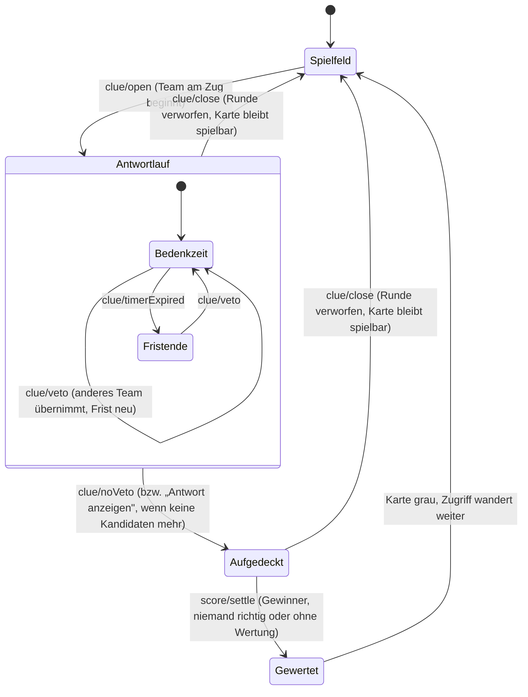

# Konzept – Veto-Runde

Status: Entwurf zur Abstimmung · Datum: 2026-08-16 · Grundlage: `kontext/veto-funktion/`
(Beschreibung und Mockup) · Bezug: [Technisches Konzept](./technisches-konzept.md),
[Arbeitsplan](./arbeitsplan.md)

---

## Inhalt

1. [Ziel und Kurzfassung](#1-ziel-und-kurzfassung)
2. [Ablauf](#2-ablauf)
3. [Zustandsautomat](#3-zustandsautomat)
4. [Entscheidungen und Eventualitäten](#4-entscheidungen-und-eventualitäten)
5. [Auswirkungen auf Bestehendes](#5-auswirkungen-auf-bestehendes)
6. [Datenmodell und Vertrag](#6-datenmodell-und-vertrag)
7. [Oberfläche](#7-oberfläche)
8. [Einstellung und Teilen-Link](#8-einstellung-und-teilen-link)
9. [Barrierefreiheit und Beamer](#9-barrierefreiheit-und-beamer)
10. [Teststrategie](#10-teststrategie)
11. [Persistenz und Migration](#11-persistenz-und-migration)
12. [Arbeitsschnitt](#12-arbeitsschnitt)
13. [Offene Fragen](#13-offene-fragen)
14. [Nicht Teil dieses Konzepts](#14-nicht-teil-dieses-konzepts)

---

## 1. Ziel und Kurzfassung

Heute gehört eine Frage genau einem Team: Wer am Zug ist, antwortet, und die Wertung trifft
nur dieses Team. Die Veto-Runde öffnet die Frage für alle: **Meldet sich ein anderes Team,
darf es übernehmen.** Am Ende entscheidet die Moderation, welches der beteiligten Teams
richtig lag; die übrigen Beteiligten gehen leer aus oder verlieren Punkte – je nach der
bereits vorhandenen Abzugsregel.

In einem Satz: aus „ein Team pro Frage" wird „ein Team gewinnt die Frage, mehrere können
sich daran versuchen".

Die Funktion ist **optional** und wird auf der Startseite eingeschaltet. Bleibt sie aus,
verhält sich das Spiel exakt wie heute.

---

## 2. Ablauf

### 2.1 Regelfall

1. Eine Karte wird geöffnet. Das Team am Zug (bisherige Reihum-Logik) beginnt, seine
   Bedenkzeit läuft – sofern eine eingestellt ist.
2. Im Popup stehen neben der Frage **ein Knopf je noch nicht beteiligtem Team** („Veto:
   Blaue Zwerge") sowie **„Kein Veto"**.
3. Meldet sich ein Team, drückt die Moderation dessen Knopf. Damit ist dieses Team am Zug,
   seine Bedenkzeit beginnt von vorn, und es steht in der Liste der Beteiligten.
4. Das wiederholt sich, bis entweder **„Kein Veto"** gedrückt wird oder **kein Team mehr
   übrig** ist, das noch nicht dran war – die Vetos können sich also erschöpfen.
5. Aufgedeckt wird immer per Klick: „Kein Veto" bzw., wenn keine Kandidaten mehr da sind,
   „Antwort anzeigen". Auch nach abgelaufener Bedenkzeit deckt die Oberfläche nicht von
   selbst auf.
6. In der Wertung wählt die Moderation, **welches beteiligte Team richtig lag**. Dieses Team
   erhält die Punkte. Alle übrigen Beteiligten erhalten 0 Punkte oder verlieren die Punktzahl
   der Frage – je nach Einstellung „Spielregeln". Teams, die sich nicht beteiligt haben,
   bleiben unberührt.
7. Alternativ stehen **„Niemand richtig"** (alle Beteiligten falsch) und **„Ohne Wertung"**
   (Frage abschließen, niemand bekommt oder verliert Punkte) zur Wahl.

### 2.2 Zuordnung zum Mockup

Das Mockup (`kontext/veto-funktion/veto-funktion.png`) zeigt genau Schritt 2: Kategorie und
Punktzahl in der Kopfzeile, darunter die Frage, darunter der Countdown, darunter die
Veto-Knöpfe und „Kein Veto". Die Reihenfolge übernehme ich unverändert; die Knöpfe tragen
statt „Veto 1 / Veto 2" die **echten Teamnamen**, damit die Moderation nicht zuordnen muss.

---

## 3. Zustandsautomat



Zwei Dinge sind daran wichtig:

- **Der Antwortlauf ist eine Schleife,** keine feste Reihenfolge. Wer als Nächstes antwortet,
  bestimmt die Moderation per Veto-Knopf, nicht der Index im Team-Array.
- **Gewertet wird genau einmal,** am Ende, für alle Beteiligten gemeinsam. Das ersetzt in
  diesem Modus die heutige Einzelwertung je Team.

---

## 4. Entscheidungen und Eventualitäten

Die Rohfassung ließ an mehreren Stellen Spielraum. Der Großteil ist inzwischen
**entschieden** (Rückmeldung vom 16.08.2026); die drei verbliebenen Punkte stehen in
[Kapitel 13](#13-offene-fragen).

### 4.1 Wann erscheinen die Veto-Knöpfe? — entschieden

| Möglichkeit                                       | Bewertung                                                                                                                                                                   |
| ------------------------------------------------- | --------------------------------------------------------------------------------------------------------------------------------------------------------------------------- |
| **Sofort mit dem Öffnen der Karte** (entschieden) | Entspricht dem Mockup, in dem Countdown und Veto-Knöpfe zusammen stehen. Die Moderation kann jederzeit reagieren – auch wenn ein Team schon vor der Antwort dazwischenruft. |
| Erst nachdem das Team am Zug geantwortet hat      | Verworfen: bräuchte einen zusätzlichen Knopf „hat geantwortet" – ein Klick mehr in jeder Frage, ohne erkennbaren Gewinn.                                                    |

### 4.2 Wer darf ein Veto einlegen? — entschieden

Jedes Team, das bei **dieser Frage** noch nicht am Zug war: **eine Antwort je Team und
Frage.** Beteiligte verschwinden aus der Knopfliste. Die Vetos können sich damit vollständig
erschöpfen – dann bleibt nur noch das Aufdecken.

### 4.3 Was passiert, wenn die Bedenkzeit abläuft? — entschieden

**Nach Fristablauf muss die Moderation eine der Veto-Entscheidungen treffen.** Die Zeit
endet, der Countdown zeigt „Zeit abgelaufen", und die Auswahl bleibt stehen:

| Fall                          | Verhalten                                                                                     |
| ----------------------------- | --------------------------------------------------------------------------------------------- |
| Es gibt noch Kandidaten       | Veto-Knöpfe und „Kein Veto" bleiben offen. Ohne Klick geschieht nichts.                       |
| Es gibt keine Kandidaten mehr | Es bleibt allein „Antwort anzeigen". Auch hier deckt die Oberfläche **nicht** von selbst auf. |

Kein automatisches Aufdecken, kein automatisches Weiterrücken: Im Veto-Modus geht jeder
Übergang von einem Klick der Moderation aus. Das ist eine Regel statt mehrerer Sonderfälle
und verhindert, dass am Beamer etwas passiert, während gerade diskutiert wird.

**Zum Vergleich:** Ohne Veto bleibt es beim heutigen Verhalten – Fristablauf rückt
automatisch zum nächsten Team weiter, und wenn alle durch sind, gilt die Frage als nicht
beantwortet.

### 4.4 Wie wird gewertet?

| Wahl der Moderation                             | Wirkung                                                                                                                                                                |
| ----------------------------------------------- | ---------------------------------------------------------------------------------------------------------------------------------------------------------------------- |
| **„<Team> richtig"** (ein Knopf je Beteiligtem) | Dieses Team erhält die volle Punktzahl. Alle anderen Beteiligten: 0 Punkte oder −Punktzahl, je nach Abzugsregel.                                                       |
| **„Niemand richtig"**                           | Alle Beteiligten werden als falsch gewertet (0 oder −Punktzahl).                                                                                                       |
| **„Ohne Wertung"**                              | Die Frage gilt als gespielt, niemand bekommt oder verliert Punkte. Für den Fall, dass niemand ernsthaft geantwortet hat, etwa weil die Zeit ungenutzt verstrichen ist. |

**Teams, die nicht mitgespielt haben, bleiben in jedem Fall außen vor** – sie tauchen weder
als Knopf auf noch werden sie belastet, auch nicht bei „Niemand richtig". Der Punktestand
bleibt wie bisher bei null geklammert, und zwar je Wertung einzeln.

### 4.5 Kann ein unbeteiligtes Team als Gewinner gewählt werden? — entschieden

**Nein.** Zur Auswahl stehen ausschließlich Teams, die sich beteiligt haben; unbeteiligte
Teams sind von der Wertung ausgenommen. Ein nachträgliches Eintragen gibt es nicht, weil es
genau die Trennung aufweichen würde, die diese Regel schafft.

Hat die Moderation ein Veto übersehen, führen zwei Wege heraus: **„Letztes Veto zurücknehmen"**
vor dem Aufdecken (siehe 4.6) oder das Popup schließen – dann ist die Runde verworfen und die
Karte wieder spielbar.

### 4.6 Fehlbedienung und Rücknahme

| Situation                               | Verhalten                                                                                                                                                                                              |
| --------------------------------------- | ------------------------------------------------------------------------------------------------------------------------------------------------------------------------------------------------------ |
| Veto versehentlich auf das falsche Team | Knopf **„Letztes Veto zurücknehmen"** stellt den vorherigen Zustand her: Das Team verlässt die Beteiligtenliste, der Zugriff geht zurück, die Bedenkzeit startet neu. Nur bis zum Aufdecken verfügbar. |
| Veto auf ein bereits beteiligtes Team   | Wird nicht angeboten; der Reducer weist es zusätzlich ab.                                                                                                                                              |
| Doppelklick auf denselben Veto-Knopf    | Der zweite Klick bleibt wirkungslos (Team ist bereits am Zug).                                                                                                                                         |
| Doppelklick in der Wertung              | Die erste Wertung zählt, die zweite wird abgewiesen – wie heute schon.                                                                                                                                 |
| Popup schließen, bevor gewertet wurde   | Die ganze Runde wird verworfen, die Karte bleibt farbig und spielbar. Beteiligte werden vergessen. Das entspricht der bestehenden Regel „nur ein Punktebutton graut die Karte".                        |

### 4.7 Zusammenspiel mit vorhandenen Einstellungen

| Einstellung              | Zusammenspiel                                                                                                                                                                                |
| ------------------------ | -------------------------------------------------------------------------------------------------------------------------------------------------------------------------------------------- |
| **Bedenkzeit aus**       | Veto funktioniert unverändert, nur ohne Countdown. Die Moderation steuert allein über die Knöpfe; aufgedeckt wird über „Kein Veto".                                                          |
| **Bedenkzeit an**        | Jedes übernehmende Team bekommt die **volle** eingestellte Zeit, nicht den Rest des Vorgängers.                                                                                              |
| **Abzugsregel an/aus**   | Entscheidet, ob unterlegene Beteiligte −Punktzahl oder 0 bekommen. Keine eigene Einstellung nötig.                                                                                           |
| **Übungsmodus (1 Team)** | Es gibt nie Kandidaten. Die Veto-Auswahl erscheint nicht, die Wertung zeigt nur „Team A richtig", „Niemand richtig" und „Ohne Wertung". Die Einstellung bleibt wählbar, wirkt aber nicht.    |
| **2 Teams**              | Nach dem Veto des zweiten Teams sind die Vetos erschöpft; es bleibt „Antwort anzeigen".                                                                                                      |
| **8 Teams**              | Bis zu sieben Veto-Knöpfe. Layout siehe [Kapitel 7](#7-oberfläche).                                                                                                                          |
| **Reihum-Zugriff**       | Unverändert: Wer eine neue Frage beginnt, bestimmt weiterhin `startingTeamIndex`, und dieser wandert nach jeder abgeschlossenen Frage weiter – unabhängig davon, wer die Frage gewonnen hat. |

### 4.8 Weitere Randfälle

| Fall                                          | Verhalten                                                                                                                                                                                                                                                     |
| --------------------------------------------- | ------------------------------------------------------------------------------------------------------------------------------------------------------------------------------------------------------------------------------------------------------------- |
| Team wird während der Runde umbenannt         | Knöpfe und Wertung übernehmen den neuen Namen sofort (Namen werden nie kopiert, immer aus dem Spielstand gelesen).                                                                                                                                            |
| Seite wird mitten in der Runde neu geladen    | Die Runde lebt im Spielstand und wird mitgespeichert: Beteiligte, aktuelles Team und Frist stehen nach dem Fortsetzen wieder da. Die verbleibende Zeit ergibt sich aus dem gespeicherten Fristende – ist sie inzwischen verstrichen, gilt sie als abgelaufen. |
| „Neues Spiel" während der Runde               | Setzt alles zurück, wie heute.                                                                                                                                                                                                                                |
| Alle 25 Karten gewertet                       | Endstand wie bisher. Da eine Frage nun mehrere Wertungen erzeugen kann, zählt für das Spielende die Anzahl **gewerteter Karten**, nicht die Anzahl Wertungen.                                                                                                 |
| Statistik im Übungsmodus („x von 25 richtig") | Zählt weiterhin die richtigen Wertungen des Teams; unverändert gültig.                                                                                                                                                                                        |
| Gleichstand im Endstand                       | Unverändert: gleicher Rang, Hinweis „Unentschieden".                                                                                                                                                                                                          |
| Frage ohne Beteiligte                         | Kann nicht entstehen: Das Team am Zug ist ab dem Öffnen beteiligt. „Ohne Wertung" bleibt trotzdem verfügbar.                                                                                                                                                  |

---

## 5. Auswirkungen auf Bestehendes

Drei Stellen ändern sich spürbar. Sie sind der Grund, warum dieses Konzept vor der Umsetzung
abgestimmt gehört.

### 5.1 Mehrere Wertungen je Frage

Bisher gilt: **eine Frage, eine Wertung, ein Team.** Darauf bauen der Doppelklickschutz, die
Markierung „bereits gespielt" und die Anzeige des Ausgangs auf der Karte auf. Mit der
Veto-Runde können mehrere Wertungen zu einer Frage gehören (ein Gewinner, mehrere
Unterlegene).

Die Umstellung ist überschaubar, weil das Modell schon ein Ereignisprotokoll führt:
`selectIsClueScored` bleibt „mindestens eine Wertung vorhanden", der Punktestand faltet
weiterhin alle Ereignisse. Angepasst werden müssen die Anzeige des Kartenausgangs
(Kapitel 7.3) und die Zählung der gespielten Karten.

### 5.2 Die vier Punkteknöpfe

Die ursprüngliche Anforderung schreibt die Knöpfe „Team A richtig / Team A falsch / Team B
richtig / Team B falsch" wörtlich fest. Im Veto-Modus passen sie nicht mehr: Dort wählt die
Moderation **einen Gewinner**, alles andere ergibt sich.

**Entschieden:** Die vier Knöpfe bleiben unverändert der Normalfall (Veto aus). Bei
eingeschalteter Veto-Runde tritt die Gewinnerauswahl an ihre Stelle. Damit bleibt die
ursprüngliche Anforderung in ihrer Standardkonfiguration wörtlich erfüllt, und die neue
Mechanik bekommt die Bedienung, die zu ihr passt.

Angenehmer Nebeneffekt: Weil die Auswahl nur Beteiligte auflistet, ist die Regel „wer nicht
mitgespielt hat, wird nicht gewertet" nicht extra zu programmieren – sie ergibt sich aus der
Oberfläche.

### 5.3 Automatisches Weiterrücken bei Fristablauf

Ohne Veto rückt der Zugriff bei abgelaufener Zeit automatisch weiter, und wenn alle durch
sind, gilt die Frage als „nicht beantwortet". Mit Veto übernimmt die Moderation diese
Steuerung. Beide Mechaniken schließen einander aus; welche gilt, entscheidet die Einstellung.

---

## 6. Datenmodell und Vertrag

### 6.1 Zustand

```ts
export interface GameState {
  // … bestehende Felder …

  /** Ob die Veto-Runde gespielt wird. Einstellung von der Startseite. */
  vetoEnabled: boolean;

  /**
   * Teams, die bei der offenen Frage bereits am Zug waren – in der Reihenfolge
   * ihrer Beteiligung. Das erste Element ist das Team, das die Frage begonnen hat,
   * das letzte das aktuell antwortende.
   */
  answeringTeamIds: string[];
}
```

`activeTeamIndex` wird durch **`activeTeamId: string | null`** ersetzt. Ein Index in die
Teamliste trägt nicht mehr, sobald die Reihenfolge von der Moderation bestimmt wird; die ID
funktioniert in beiden Modi. `startingTeamIndex` bleibt, weil der Reihum-Zugriff weiterhin
über die Position läuft.

### 6.2 Actions

```ts
| { type: 'clue/veto'; teamId: string; at: number }   // Team übernimmt den Zugriff
| { type: 'clue/vetoUndo'; at: number }               // letztes Veto zurücknehmen
| { type: 'clue/noVeto' }                             // kein Veto -> Antwort aufdecken
| {
    type: 'score/settle';
    clueId: string;
    /** Gewinner; null bedeutet „niemand richtig". */
    winnerTeamId: string | null;
    /** true: Frage ohne jede Wertung abschließen. */
    withoutScoring?: boolean;
    at: number;
  }
```

`score/award` bleibt für den Normalfall ohne Veto erhalten – die vier Knöpfe funktionieren
unverändert. `clue/revealAnswer` bleibt ebenfalls; `clue/noVeto` ist im Veto-Modus der
fachlich richtige Name für denselben Übergang und beendet zusätzlich die Veto-Auswahl.

### 6.3 Selektoren

```ts
/** Teams, die bei der offenen Frage noch ein Veto einlegen dürfen. */
export function selectVetoCandidates(state: GameState): Team[];

/** Teams, die sich an der offenen Frage beteiligt haben – in Reihenfolge. */
export function selectAnsweringTeams(state: GameState): Team[];

/** Zusammenfassung einer gespielten Frage für das Spielfeld. */
export function selectClueSummary(
  state: GameState,
  clueId: string,
): {
  winner: Team | null;
  losers: Team[];
  points: number;
  outcome: 'correct' | 'wrong' | 'unanswered';
} | null;
```

`selectClueResult` wird von `selectClueSummary` abgelöst; die bisherige Anzeige lässt sich
daraus unverändert ableiten (Gewinner statt einzelnem Team).

### 6.4 Regeln im Reducer

- `clue/veto` wirkt nur, wenn die Frage offen, noch nicht aufgedeckt, das Team unbeteiligt
  und Veto eingeschaltet ist. Es setzt `activeTeamId`, hängt das Team an `answeringTeamIds`
  und startet die Frist neu.
- `clue/vetoUndo` entfernt das letzte Team wieder und stellt Zugriff und Frist des Vorgängers
  her. Nach dem Aufdecken wirkungslos.
- `clue/noVeto` deckt auf und beendet die Frist.
- Fristablauf mit Kandidaten: nur die Frist endet. Ohne Kandidaten: Antwort wird aufgedeckt.
- `score/settle` erzeugt **eine Wertung je Beteiligtem**: Gewinner `+Punkte`, übrige
  `-Punkte` oder `0` – oder, bei „Ohne Wertung", genau eine Wertung `unanswered` ohne Team.
  Danach schließt das Popup, die Karte wird grau, der Reihum-Zugriff wandert weiter.
- Der Reducer bleibt rein: Zeitstempel kommen aus der Action, IDs aus dem Zustand.

---

## 7. Oberfläche

### 7.1 Antwortlauf (Veto-Modus)

Aufbau wie im Mockup, ergänzt um das, was die Moderation zum Überblick braucht:

```
┌──────────────────────────────────────────────────────────────┐
│ ERDKUNDE                                          300 Punkte │
│                                                              │
│            Welcher Ozean liegt zwischen …?                   │
│                                                              │
│                 Bedenkzeit für Blaue Zwerge                  │
│                            27                                │
│                    ▓▓▓▓▓▓▓▓▓▓░░░░░░░                         │
│                                                              │
│   Bereits dran: Rote Riesen · Blaue Zwerge                   │
│                                                              │
│   [ Veto: Grüne Riesen ]  [ Veto: Gelbe Sterne ]             │
│   [ Kein Veto – Antwort aufdecken ]                          │
│   [ Letztes Veto zurücknehmen ]                    [Schließen]│
└──────────────────────────────────────────────────────────────┘
```

- **Veto-Knöpfe** in der Farbe der neutralen Variante, ein Knopf je Kandidat, in Teamreihenfolge.
- **„Kein Veto – Antwort aufdecken"** als hervorgehobene Hauptaktion; sind keine Kandidaten
  mehr übrig, heißt der Knopf schlicht „Antwort anzeigen".
- **Beteiligtenzeile** nennt die Teams, die schon dran waren – sonst verliert die Moderation
  bei sechs Teams den Überblick.
- **„Letztes Veto zurücknehmen"** erscheint erst, wenn mindestens ein Veto erfolgt ist.
- Layout: Veto-Knöpfe in einem umbrechenden Raster (zwei Spalten ab vier Kandidaten), damit
  das Popup bei acht Teams nicht über den Bildschirm hinauswächst.

### 7.2 Wertung (Veto-Modus)

Nach dem Aufdecken: Musterlösung wie bisher, darunter

```
   Wer lag richtig?
   [ Rote Riesen ]  [ Blaue Zwerge ]  [ Grüne Riesen ]
   [ Niemand richtig ]        [ Ohne Wertung ]
   ▸ anderes Team wählen
```

- Ein Knopf je Beteiligtem, grün getönt.
- „Niemand richtig" rot getönt, „Ohne Wertung" neutral.
- „anderes Team wählen" ist zugeklappt und listet die unbeteiligten Teams (Fall 4.5).
- Unter den Knöpfen steht als Hinweis, was mit den übrigen Beteiligten geschieht – abhängig
  von der Abzugsregel: „Die übrigen beteiligten Teams verlieren 300 Punkte." bzw. „… erhalten
  keine Punkte."

### 7.3 Karte im Spielfeld

Die Karte zeigt weiterhin **den Ausgang aus Sicht des Gewinners**: Häkchen und grüne
Punktzahl mit dessen Namen. Zusätzlich, wenn mehrere Teams beteiligt waren, eine dezente
Angabe der Beteiligtenzahl, etwa „Rote Riesen · 3 Teams". Bei „Niemand richtig" das Kreuz mit
durchgestrichener Punktzahl und der Angabe, wie viele Teams es versucht haben; bei „Ohne
Wertung" wie bisher neutral.

### 7.4 Ohne Veto

Unverändert: „Antwort anzeigen", danach die vier bzw. 2 × n Punkteknöpfe.

---

## 8. Einstellung und Teilen-Link

- Auf der Startseite, direkt unter „Spielregeln", eine Auswahl im selben Kartenstil:
  **„Ohne Veto"** (Standard) gegen **„Mit Veto-Runde"**, je mit einer Zeile Erklärung.
- Im Teilen-Link ein zusätzlicher Parameter `veto=1`; fehlt er, wird ohne Veto gespielt. Der
  geteilte Dialog zeigt die Einstellung als Abzeichen, wie Bedenkzeit und Abzugsregel.
- Im Übungsmodus bleibt die Auswahl sichtbar, aber wirkungslos – mit einem Hinweis, dass sie
  erst ab zwei Teams greift.

---

## 9. Barrierefreiheit und Beamer

- Die Veto-Knöpfe sind normale Schaltflächen mit vollständigem Namen („Veto: Grüne Riesen"),
  also per Tastatur erreichbar und vorlesbar.
- Der Wechsel des antwortenden Teams wird über die bestehende `aria-live`-Zeile gemeldet
  („Grüne Riesen ist am Zug"), nicht über die Countdown-Ziffern.
- Die Beteiligtenzeile ist Text, keine reine Farbcodierung.
- Das Popup muss bei acht Teams und 1280 × 720 ohne Scrollen passen: Veto-Knöpfe umbrechend,
  Beteiligtenzeile einzeilig mit Kürzung, Frage bei Bedarf eine Stufe kleiner.

---

## 10. Teststrategie

**Kern (Reducer/Selektoren), je mit 2, 3 und 8 Teams:**

- Veto setzt den Zugriff um, startet die Frist neu und ergänzt die Beteiligtenliste.
- Ein bereits beteiligtes Team kann kein zweites Veto einlegen.
- Fristablauf mit Kandidaten deckt **nicht** auf; ohne Kandidaten deckt er auf.
- „Kein Veto" deckt auf und beendet die Frist.
- Rücknahme stellt Zugriff, Beteiligtenliste und Frist wieder her; nach dem Aufdecken
  wirkungslos.
- Wertung: Gewinner bekommt Punkte, übrige Beteiligte verlieren Punkte bzw. bekommen 0
  (beide Abzugsregeln), Unbeteiligte bleiben unberührt.
- „Niemand richtig" und „Ohne Wertung" erzeugen die erwarteten Wertungen.
- Punktestand bleibt bei jeder Kombination bei null geklammert.
- Karte gilt nach der Wertung als gespielt; Spielende zählt Karten, nicht Wertungen.
- Ohne eingeschaltetes Veto ändert sich nichts am heutigen Verhalten (Regressionsnachweis).

**Oberfläche:**

- Veto-Knöpfe erscheinen nur für Kandidaten und verschwinden nach Beteiligung.
- Im Übungsmodus erscheint keine Veto-Auswahl.
- Wertung listet genau die Beteiligten.
- Hinweistext zur Abzugsregel stimmt mit der Einstellung überein.

**End-to-End:**

- Vollständiger Durchlauf mit drei Teams: Frage öffnen, Veto, Veto, aufdecken, Gewinner
  wählen, Punktestände und Kartenmarkierung prüfen.
- Durchlauf mit abgeschalteter Abzugsregel: Unterlegene behalten ihre Punkte.
- Neuladen mitten in der Veto-Runde: Zustand ist wiederhergestellt.
- Regressionslauf ohne Veto: die sechs bestehenden Kernregeln bleiben grün.

---

## 11. Persistenz und Migration

Der gespeicherte Spielstand bekommt die Felder `vetoEnabled`, `answeringTeamIds` und
`activeTeamId`. Ältere Einträge fallen wie schon bei der letzten Erweiterung durch die
Schemaprüfung und werden verworfen – ein laufendes Spiel überlebt das Update also nicht. Der
Alternativweg wäre eine Migration mit Standardwerten; sie lohnt erst, wenn das Spiel
außerhalb der Entwicklung produktiv genutzt wird.

---

## 12. Arbeitsschnitt

Nach dem bewährten Muster: erst der gemeinsame Unterbau, dann parallele Pakete mit getrennter
Dateihoheit.

| ID     | Paket                                                                                    | Dateihoheit                         | Abhängig von |
| ------ | ---------------------------------------------------------------------------------------- | ----------------------------------- | ------------ |
| **V0** | Unterbau: Zustand, Actions, Reducer-Regeln, Selektoren, Texte, Kern-Tests                | `packages/game-core/`, `i18n/de.ts` | –            |
| **V1** | Antwortlauf im Popup: Veto-Knöpfe, Beteiligtenzeile, Rücknahme, Aufdecken                | `apps/web/src/features/clue/`       | V0           |
| **V2** | Wertung im Popup: Gewinnerauswahl, „Niemand richtig", „Ohne Wertung", erweiterte Auswahl | `apps/web/src/features/clue/`       | V0, V1       |
| **V3** | Einstellung auf der Startseite und im Teilen-Link                                        | `apps/web/src/features/setup/`      | V0           |
| **V4** | Kartenanzeige mit mehreren Beteiligten                                                   | `apps/web/src/features/board/`      | V0           |
| **V5** | End-to-End-Tests und Abnahme                                                             | `e2e/`                              | V1–V4        |

V1 und V2 liegen im selben Ordner und gehören daher in eine Hand – nacheinander, nicht
parallel. V3 und V4 laufen unabhängig davon.

Aufwand grob: V0 etwa ein Personentag, V1 und V2 zusammen etwa anderthalb, V3 und V4 je ein
halber, V5 ein halber. In Summe rund vier Personentage.

---

## 13. Offene Fragen

Vier der ursprünglich fünf Punkte sind mit deiner Rückmeldung vom 16.08.2026 entschieden und
oben eingearbeitet: Veto-Knöpfe erscheinen sofort (4.1), eine Antwort je Team (4.2), nach
Fristablauf entscheidet die Moderation (4.3), Gewinnerauswahl statt der vier Punkteknöpfe im
Veto-Modus, wobei Unbeteiligte nie gewertet werden (4.5, 5.2).

Offen sind noch drei Punkte:

### 13.1 Braucht es „Ohne Wertung" neben „Niemand richtig"?

Weil es keinen Knopf „hat geantwortet" gibt, **gilt jedes Team, das am Zug war, als
beteiligt** – auch eines, dessen Zeit ungenutzt verstrichen ist. Bei „Niemand richtig" würde
es dann Punkte verlieren, obwohl es geschwiegen hat.

- _Vorschlag:_ zusätzlich **„Ohne Wertung"**, das die Frage abschließt, ohne jemanden zu
  belasten. Ein Knopf mehr, aber der einzige Weg, das Schweigen vom Falschantworten zu
  unterscheiden.
- _Alternative:_ nur „Niemand richtig" – kürzer, aber wer nichts sagt, zahlt drauf.

### 13.2 Volle Bedenkzeit oder Restzeit für ein übernehmendes Team?

- _Vorschlag:_ **volle Zeit** für jedes Team. Gleiche Bedingungen, leicht zu erklären.
- _Alternative:_ die verbleibende Restzeit des Vorgängers. Macht ein spätes Veto riskant und
  belohnt schnelles Melden, kann aber auf wenige Sekunden hinauslaufen.

### 13.3 Soll „Letztes Veto zurücknehmen" mit hinein?

- _Vorschlag:_ **ja.** Ein falsch getroffenes Veto lässt sich sonst nur durch Schließen und
  Neuöffnen der Frage heilen, und das mitten im Spiel.
- _Alternative:_ weglassen und auf das Schließen verweisen – ein Knopf weniger im Popup, das
  bei acht Teams ohnehin voll ist.

## 14. Nicht Teil dieses Konzepts

- **Buzzer-Hardware oder Reaktionsmessung.** Wer zuerst „Veto" ruft, entscheidet die
  Moderation; die Oberfläche misst nichts.
- **Online-Modus.** Die Veto-Runde ist allerdings genau die Stelle, an der später ein Buzzer
  andockt: Ein Spielergerät löst dieselbe `clue/veto`-Action aus, die heute die Moderation
  auslöst. Der Zeitstempel in der Action entscheidet dann über die Reihenfolge.
- **Mehrfachversuche desselben Teams** innerhalb einer Frage.
- **Teilpunkte** für halbrichtige Antworten.
