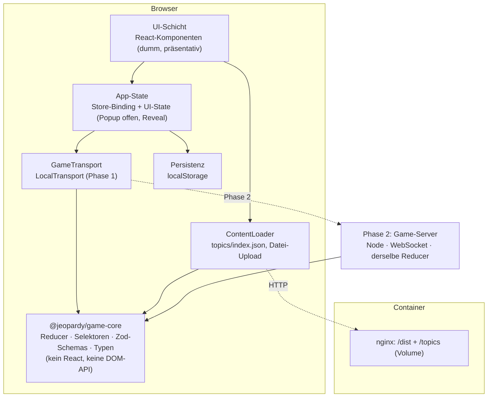
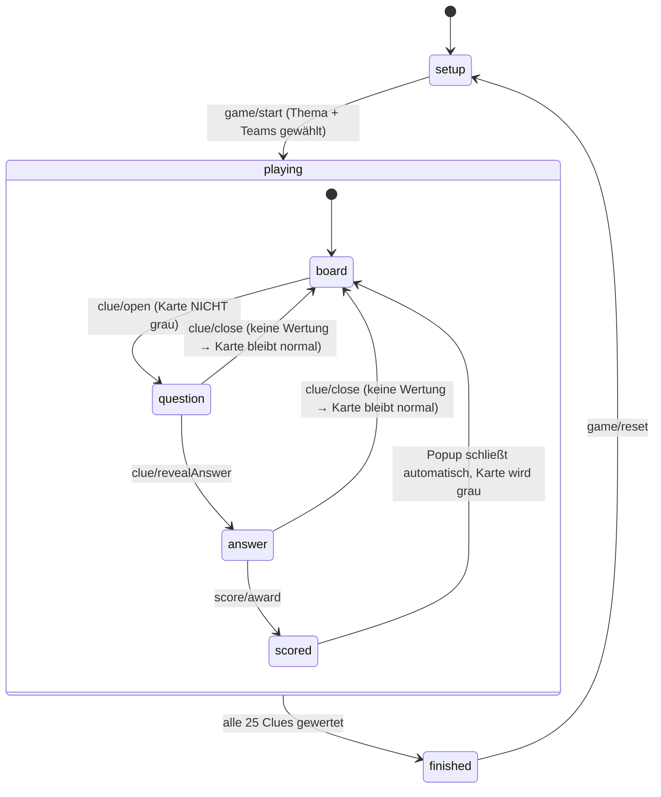

# Technisches Konzept – Web-Jeopardy

Status: Entwurf v1.0 · Datum: 2026-08-16 · Zielbild: lokal spielbare Jeopardy-Web-App (Beamer/Moderator), später Online-/Multiplayer-fähig, Auslieferung als Docker-Container.

Begleitdokument: [Arbeitsplan & Subtasks](./arbeitsplan.md)

---

## Inhalt

1. [Zielsetzung & Scope](#1-zielsetzung--scope)
2. [Anforderungs-Klärungen & getroffene Entscheidungen](#2-anforderungs-klärungen--getroffene-entscheidungen)
3. [Technologie-Entscheidung](#3-technologie-entscheidung)
4. [Systemarchitektur](#4-systemarchitektur)
5. [Datenmodell & JSON-Format](#5-datenmodell--json-format)
6. [Schnittstellen-Vertrag (Basis für Parallelisierung)](#6-schnittstellen-vertrag-basis-für-parallelisierung)
7. [Spiellogik & Zustandsautomat](#7-spiellogik--zustandsautomat)
8. [Design-System](#8-design-system)
9. [UI-Spezifikation der Screens](#9-ui-spezifikation-der-screens)
10. [Persistenz](#10-persistenz)
11. [Multiplayer-Vorbereitung (Phase 2)](#11-multiplayer-vorbereitung-phase-2)
12. [Deployment / Docker](#12-deployment--docker)
13. [Qualitätssicherung & Teststrategie](#13-qualitätssicherung--teststrategie)
14. [Nicht-funktionale Anforderungen](#14-nicht-funktionale-anforderungen)
15. [Risiken](#15-risiken)
16. [Erweiterungen aus Runde 2](#16-erweiterungen-aus-runde-2)

---

## 1. Zielsetzung & Scope

**Phase 1 (MVP, dieses Konzept im Detail):**
Eine Single-Page-Application, die von einem Moderator auf einem Rechner bedient und per Beamer/Screenshare gezeigt wird. Startseite → Themenauswahl & Teamkonfiguration (beliebig viele Teams; **ein Team = Übungsmodus**) → 5×5-Spielfeld → Frage-Popup → Punktevergabe → Endstand.

**Phase 2 (architektonisch vorbereitet, nicht Teil des MVP):**
Online-Mehrspielerbetrieb: Räume mit Code, getrennte Moderator-/Spieler-Ansicht, Buzzer, serverautoritativer Spielstand.

**Explizit nicht im MVP:** Benutzerkonten, Persistenz auf Server, Editor-UI für Fragensets (Fragensets werden als JSON gepflegt), Sound, Daily Double, Final Jeopardy.

---

## 2. Anforderungs-Klärungen & getroffene Entscheidungen

Die Vorgaben aus `details.md` sind bindend. An vier Stellen ergänzen sie sich nicht widerspruchsfrei – hier die getroffene Auflösung, damit alle Teilteams identisch implementieren:

| #   | Sachverhalt                                                                                                                                                                 | Konflikt / Lücke                                        | Entscheidung                                                                                                                                                                                                                                                                                                                                                                                                                                                                                                    |
| --- | --------------------------------------------------------------------------------------------------------------------------------------------------------------------------- | ------------------------------------------------------- | --------------------------------------------------------------------------------------------------------------------------------------------------------------------------------------------------------------------------------------------------------------------------------------------------------------------------------------------------------------------------------------------------------------------------------------------------------------------------------------------------------------- |
| K1  | Punktebuttons heißen exakt „Team A richtig / Team A falsch / Team B richtig / Team B falsch"; die Startseite erlaubt aber **beliebig viele Teams mit frei wählbaren Namen** | Feste Buttonbeschriftung vs. variable Teamanzahl        | **Generische Regel für beliebig viele Teams:** Für jedes Team `t` werden genau zwei Buttons erzeugt – `` `${t.name} richtig` `` und `` `${t.name} falsch` `` – in Teamreihenfolge, also **2 × n Buttons**. Bei der Standardkonfiguration (n = 2, „Team A"/„Team B") ergibt das **wortwörtlich** die vier geforderten Buttons. Dieselbe Regel gilt unverändert für n = 1 (Übungsmodus → 2 Buttons) und n > 2 (z. B. n = 4 → 8 Buttons). **Kein Sonderfall im Code, keine hartkodierte Beschriftung** – siehe K4. |
| K2  | „Karten werden erst grau, wenn ein Punktebutton gedrückt wurde – nicht beim bloßen Öffnen."                                                                                 | Verhalten nach der Wertung ungeklärt                    | Ein Klick auf einen Punktebutton **wertet, schließt das Popup und graut die Karte**. Graue Karten sind danach **nicht mehr anklickbar** (`disabled`, `aria-disabled`). Mehrfachwertung derselben Frage und „Wertung rückgängig" sind als optionale Erweiterung vorgesehen (Backlog `BL-1`/`BL-2`), das Datenmodell (Event-Log) unterstützt beides bereits.                                                                                                                                                      |
| K3  | „Punkte … niemals unter 0"                                                                                                                                                  | Unklar, ob die Summe oder jeder Schritt geklammert wird | Die Klammerung erfolgt **schrittweise beim Falten des Event-Logs**: `score = events.reduce((s, e) => Math.max(0, s + e.delta), 0)`. Beispiel: Stand 100, falsche Antwort auf 200er-Frage → **0** (nicht −100). Ein anschließendes „richtig" auf 300 → 300.                                                                                                                                                                                                                                                      |
| K4  | „Anzahl der Teams … kann gewählt werden"                                                                                                                                    | Unter-/Obergrenze und Solo-Betrieb ungeklärt            | **n ≥ 1**, Default **2**. **n = 1 ist der Übungsmodus (Solo/Training):** identische Spiellogik (richtig/falsch, Klammerung bei 0, Karte wird grau), aber **kein Ranking und kein Sieger** – der Endstand zeigt Punktestand und Trefferquote („18 von 25 Fragen richtig"). Logik und Datenmodell kennen **keine Obergrenze**; die Oberfläche bietet aus Layoutgründen 1–8 Teams an.                                                                                                                              |

Weitere Festlegungen:

- **Teamanzahl & Default-Namen:** Teams werden generisch als `Team[]` geführt (Reihenfolge = Anzeigereihenfolge). Default-Namen `Team A`, `Team B`, `Team C`, … über `String.fromCharCode(65 + index)`, frei überschreibbar. Alle Ableitungen – Buttonbeschriftungen, Teamkacheln, Ranking – ergeben sich **ausschließlich** aus dieser Liste; nirgends wird auf „genau zwei Teams" hin programmiert.
- **Punktestaffel:** 100/200/300/400/500 als Default, im JSON pro Fragenset überschreibbar.
- **Kategoriefarben:** die fünf vorgegebenen Hex-Werte werden **in Reihenfolge der Kategorien** (Index 0–4) zugewiesen. Ein optionales `color`-Feld im JSON darf nur einen dieser fünf Werte enthalten (Schema-validiert).
- **Sprache:** Oberfläche Deutsch. Alle sichtbaren Texte liegen zentral in `apps/web/src/i18n/de.ts` (kein i18n-Framework im MVP, aber vorbereitet für Wechsel).
- **Antwort-Terminologie:** Wie in `details.md` verwendet die UI „Frage" (`question`) und „Musterlösung/Antwort" (`answer`) – nicht die klassische Jeopardy-Umkehrung.

---

## 3. Technologie-Entscheidung

Vorgabe: „modernes CSS-/JavaScript-Framework", später Multiplayer, Auslieferung per Docker.

### Gewählter Stack

| Bereich         | Wahl                                                                          | Begründung                                                                                                                                                                                                                                                                               |
| --------------- | ----------------------------------------------------------------------------- | ---------------------------------------------------------------------------------------------------------------------------------------------------------------------------------------------------------------------------------------------------------------------------------------- |
| Sprache         | **TypeScript** (strict)                                                       | Der Schnittstellen-Vertrag (Kap. 6) ist die Voraussetzung für paralleles Arbeiten – nur mit Typen ist er maschinell durchsetzbar.                                                                                                                                                        |
| UI-Framework    | **React 19**                                                                  | Größtes Ökosystem, problemlose Rekrutierung/Onboarding, `useSyncExternalStore` erlaubt die saubere Anbindung eines framework-fremden Cores (wichtig für Phase 2, in der derselbe Reducer serverseitig läuft).                                                                            |
| Build           | **Vite**                                                                      | Schnellster Dev-Loop, natives ESM, unkomplizierter Static-Build → passt exakt zu „dist läuft über einen Docker-Container".                                                                                                                                                               |
| Styling         | **Tailwind CSS v4** (CSS-first `@theme`) + CSS Custom Properties              | Design-Tokens werden als CSS-Variablen definiert (die fünf Kategoriefarben, `#10141F`, Radien) und von Tailwind konsumiert. Keine externen Schriften (Tailwind lädt keine). Utility-Ansatz hält die Kartenoptik konsistent, ohne CSS-Wildwuchs.                                          |
| State           | **Pure Reducer in `@jeopardy/game-core`** + dünner Zustand-Store im App-Layer | Der Reducer ist frei von React und DOM, deterministisch und mit serialisierbaren Actions – dadurch in Phase 2 unverändert im Node-Server einsetzbar.                                                                                                                                     |
| Validierung     | **Zod**                                                                       | Ein Schema erzeugt Laufzeitvalidierung _und_ TS-Typ (`z.infer`) – nötig für hochgeladene/gemountete Fragensets.                                                                                                                                                                          |
| Routing         | **React Router** (2 Routen)                                                   | Minimal, aber vorbereitet für spätere Routen (`/join/:roomCode`, `/host/:roomCode`).                                                                                                                                                                                                     |
| Dialog          | **natives `<dialog>` + `showModal()`**                                        | Fokusfalle, ESC-Handling, `::backdrop` und Top-Layer kostenlos – keine zusätzliche UI-Library für das Popup nötig.                                                                                                                                                                       |
| Tests           | **Vitest** + Testing Library, **Playwright** für E2E                          | Vitest teilt die Vite-Config; E2E deckt die drei kritischen Regeln (grau erst nach Wertung, Antwort erst nach Klick, kein negativer Punktestand) ab.                                                                                                                                     |
| Monorepo        | **npm Workspaces**                                                            | Trennt Spiel-Logik, Inhalte und App; ermöglicht es Streams, unabhängig voneinander zu bauen und zu testen; Phase-2-Server hängt sich ohne Umbau an.                                                                                                                                      |
| Package-Manager | **npm** (mit Node ausgeliefert)                                               | Ursprünglich war pnpm über corepack vorgesehen; corepack ist jedoch nicht mehr Teil von Node 25 und ein globales Werkzeug soll nicht vorausgesetzt werden. npm-Workspaces decken den Bedarf vollständig ab und liefern mit `package-lock.json` ebenfalls reproduzierbare Installationen. |

> **Versionspinning:** Exakte Versionen sind beim Scaffolding (Task `T00`) festgeschrieben und über `package-lock.json` eingefroren; `.nvmrc` (Node 22) definiert die Build-Node-Version für CI und Docker – lokal genutztes Node 25 bleibt davon unberührt.
>
> **Zwei umgebungsbedingte Festlegungen:** TypeScript bleibt bei **5.9** (typescript-eslint unterstützt derzeit nur `<6.1`), ESLint bei **9** (`eslint-plugin-jsx-a11y` unterstützt ESLint 10 noch nicht).

### Verworfene Alternativen

- **SvelteKit / Nuxt:** kompakter, aber SSR bringt für eine reine Moderator-SPA keinen Nutzen; kleineres Team-Know-how-Reservoir.
- **Next.js:** SSR/Server-Actions würden Phase 2 teilweise abdecken, koppeln aber Spiel-Logik an das Framework. Ein separater, schlanker WebSocket-Server (Kap. 11) ist für Echtzeit-Buzzer die passendere Bauform.
- **Redux Toolkit als App-State:** der Reducer liegt ohnehin im Core; RTK würde nur Boilerplate ergänzen.
- **Vanilla JS/CSS:** widerspricht der Framework-Vorgabe und erschwert die Parallelisierung.

---

## 4. Systemarchitektur

### 4.1 Schichten



**Kernprinzip:** Die UI löst ausschließlich **serialisierbare Actions** aus. Diese laufen durch den `GameTransport`. In Phase 1 wendet der `LocalTransport` sie direkt lokal auf den Reducer an; in Phase 2 schickt der `WebSocketTransport` dieselben Actions an den Server und empfängt den neuen State bzw. das Action-Broadcast zurück. **Die UI muss dafür nicht angefasst werden.**

### 4.2 Repository-Struktur

```
web-jeopardy/
├─ apps/
│  └─ web/                      # Vite + React SPA
│     ├─ src/
│     │  ├─ features/
│     │  │  ├─ setup/           # Startseite
│     │  │  ├─ board/           # Spielfeld
│     │  │  ├─ clue/            # Frage-Popup
│     │  │  └─ scoreboard/      # Teamleiste, Endstand
│     │  ├─ components/ui/      # Card, Button, Modal, TextField …
│     │  ├─ state/              # Store-Binding, Transport-Wiring, Persistenz
│     │  ├─ content/            # ContentLoader (fetch, Upload, Fehlerfälle)
│     │  ├─ styles/tokens.css   # Design-Tokens (Single Source of Truth)
│     │  ├─ i18n/de.ts
│     │  └─ main.tsx
│     └─ index.html
├─ packages/
│  └─ game-core/                # Typen, Zod-Schemas, Reducer, Selektoren, Fixtures
├─ content/
│  └─ topics/                   # Fragensets als JSON + index.json
├─ docker/                      # Dockerfile, nginx.conf, compose
├─ docs/                        # dieses Konzept, Arbeitsplan, ADRs
├─ e2e/                         # Playwright
└─ Jenkinsfile                  # Pipeline für jenkins.d39s.de
```

`packages/game-core` hat **keine Runtime-Dependencies außer Zod** und ist damit sowohl im Browser als auch später im Node-Server lauffähig.

---

## 5. Datenmodell & JSON-Format

### 5.1 Fragenset (`content/topics/<id>.json`)

```json
{
  "schemaVersion": 1,
  "id": "it-grundlagen",
  "title": "IT-Grundlagen",
  "description": "Netzwerke, Hardware und ein bisschen Geschichte.",
  "author": "D. Sczyrba",
  "locale": "de-DE",
  "pointSteps": [100, 200, 300, 400, 500],
  "categories": [
    {
      "id": "netzwerke",
      "name": "Netzwerke",
      "color": "#2EC4B6",
      "clues": [
        {
          "id": "netzwerke-100",
          "points": 100,
          "question": "Welche Portnummer nutzt HTTPS standardmäßig?",
          "answer": "Port 443",
          "note": "Optionaler Moderatorenhinweis, wird nie auf dem Board gezeigt."
        }
      ]
    }
  ]
}
```

**Validierungsregeln (Zod, hart):**

| Regel                                                                          | Begründung                                            |
| ------------------------------------------------------------------------------ | ----------------------------------------------------- |
| `schemaVersion === 1`                                                          | Migrationspfad für spätere Formate.                   |
| genau **5 Kategorien**, je genau **5 Clues**                                   | Vorgabe „5×5-Grid".                                   |
| `points` einer Kategorie entsprechen `pointSteps` in aufsteigender Reihenfolge | Konsistente Board-Darstellung.                        |
| `id` global eindeutig (Set, Kategorie + Clue)                                  | Voraussetzung für Event-Log und Multiplayer.          |
| `color` optional, muss aus der 5er-Palette stammen                             | Design-Vorgabe „nicht abweichen".                     |
| `question` / `answer` nicht leer, max. 500 Zeichen                             | Layout-Sicherheit auf dem Beamer.                     |
| unbekannte Felder werden **abgelehnt** (`.strict()`)                           | Tippfehler in handgepflegten JSONs fallen sofort auf. |

### 5.2 Themenindex (`content/topics/index.json`)

```json
{
  "schemaVersion": 1,
  "topics": [
    {
      "id": "it-grundlagen",
      "title": "IT-Grundlagen",
      "description": "…",
      "file": "it-grundlagen.json"
    },
    {
      "id": "popkultur-90er",
      "title": "Popkultur der 90er",
      "description": "…",
      "file": "popkultur-90er.json"
    }
  ]
}
```

Die Startseite lädt **nur den Index** (schnell), das eigentliche Fragenset wird **lazy** beim Spielstart nachgeladen. Zusätzlich kann ein eigenes JSON per Datei-Upload eingespielt werden – es durchläuft exakt dieselbe Zod-Validierung, Fehler werden feldgenau angezeigt (`categories[2].clues[4].answer: erforderlich`).

Da `content/topics` im Container als **Volume** gemountet werden kann (Kap. 12), lassen sich neue Fragensets **ohne Rebuild** ergänzen.

---

## 6. Schnittstellen-Vertrag (Basis für Parallelisierung)

Diese Typen sind das Herzstück des Konzepts: Sie werden in Task `T01` **zuerst** implementiert und gemerged. Danach können alle Streams gegen sie entwickeln, ohne aufeinander zu warten. Änderungen daran sind ab dann **Breaking Changes** und benötigen eine kurze Abstimmung + PR-Review durch mindestens zwei Streams.

```ts
// packages/game-core/src/types.ts

// ---------- Inhalte (aus JSON) ----------
export type CategoryColor = '#2EC4B6' | '#FF7F50' | '#B388EB' | '#7AE582' | '#FFD166';

export interface Clue {
  id: string;
  points: number;
  question: string;
  answer: string;
  note?: string;
}

export interface Category {
  id: string;
  name: string;
  color?: CategoryColor; // sonst per Index aus der Palette
  clues: Clue[]; // exakt 5
}

export interface GameDefinition {
  schemaVersion: 1;
  id: string;
  title: string;
  description?: string;
  author?: string;
  locale?: string;
  pointSteps: number[]; // exakt 5
  categories: Category[]; // exakt 5
}

// ---------- Laufender Spielstand ----------
export interface Team {
  id: string; // 'team-a', 'team-b', …
  name: string; // editierbar
}
// Beliebig viele Teams: GameState.teams ist eine Liste ohne feste Länge.
// n === 1 ist der Übungsmodus – kein Sondertyp, nur ein Selektor (siehe unten).

export interface ScoreEvent {
  id: string;
  clueId: string;
  teamId: string;
  correct: boolean;
  delta: number; // +points | -points
  at: number; // epoch ms
}

export type GamePhase = 'setup' | 'playing' | 'finished';

export interface GameState {
  phase: GamePhase;
  definition: GameDefinition | null;
  teams: Team[];
  events: ScoreEvent[]; // Single Source of Truth für alle Punkte
  openClueId: string | null;
  answerRevealed: boolean;
  // ab Runde 2, siehe Kapitel 16
  timerSeconds: number | null; // Bedenkzeit je Frage, null = ohne Timer
  startingTeamIndex: number; // erster Zugriff auf die nächste Frage, wandert reihum
  activeTeamIndex: number; // Team, das bei der offenen Frage am Zug ist
  timerEndsAt: number | null; // Zeitpunkt (epoch ms), zu dem die Frist endet
  wrongPenalty: WrongPenalty; // 'full' | 'half' | 'none' – was eine falsche Antwort kostet
}

// ---------- Actions (serialisierbar, multiplayer-tauglich) ----------
export type GameAction =
  | {
      type: 'game/start';
      definition: GameDefinition;
      teams: Team[];
      timerSeconds?: number | null; // ohne Angabe: ohne Timer
      wrongPenalty?: WrongPenalty; // ohne Angabe: volle Punktzahl
    }
  | { type: 'team/rename'; teamId: string; name: string }
  | { type: 'clue/open'; clueId: string; at: number }
  | { type: 'clue/revealAnswer' }
  | { type: 'clue/close' }
  | { type: 'clue/timerExpired'; at: number }
  | { type: 'score/award'; clueId: string; teamId: string; correct: boolean; at: number }
  | { type: 'game/reset' };

// ---------- Reducer & Selektoren ----------
export function gameReducer(state: GameState, action: GameAction): GameState;

export function selectScore(state: GameState, teamId: string): number; // schrittweise auf >= 0 geklammert
export function selectIsClueScored(state: GameState, clueId: string): boolean;
export function selectOpenClue(state: GameState): { clue: Clue; category: Category } | null;
export function selectIsFinished(state: GameState): boolean; // alle 25 gewertet
export function selectRanking(state: GameState): Array<{ team: Team; score: number; rank: number }>;
export function selectIsPracticeMode(state: GameState): boolean; // teams.length === 1
export function selectTeamStats(
  state: GameState,
  teamId: string,
): { correct: number; wrong: number };
export function categoryColorAt(index: number): CategoryColor;

// ab Runde 2
export function selectClueResult(
  state: GameState,
  clueId: string,
): { outcome: 'correct' | 'wrong' | 'unanswered'; team: Team | null; delta: number } | null;
export function selectActiveTeam(state: GameState): Team | null;
export function selectStartingTeam(state: GameState): Team | null;
export function selectIsTimerRunning(state: GameState): boolean;

// Teamverwaltung – erzeugt beliebig viele Teams mit Default-Namen 'Team A', 'Team B', …
export function createDefaultTeams(count: number): Team[];
export const MAX_TEAMS_UI = 8; // reine Layoutgrenze der Oberfläche, keine Logikgrenze

// ---------- Transport (Phase-2-Naht) ----------
export interface GameTransport {
  getState(): GameState;
  dispatch(action: GameAction): void;
  subscribe(listener: (state: GameState) => void): () => void;
}
```

**Zusätzlich aus `T01`:** `packages/game-core/src/fixtures.ts` mit einem vollständigen, gültigen 5×5-Testfragenset. Damit können Board-, Popup- und Scoreboard-Teams sofort loslegen, obwohl Content-Loader und echte Inhalte noch nicht existieren.

---

## 7. Spiellogik & Zustandsautomat



**Invarianten (durch Unit-Tests abgesichert, Task `B1`):**

1. `clue/open` verändert **niemals** `events` → eine geöffnete, aber nicht gewertete Karte bleibt farbig. _(Kernanforderung)_
2. `answerRevealed` ist nach `clue/open` immer `false`; Musterlösung **und** Punktebuttons rendern ausschließlich bei `answerRevealed === true`. _(Kernanforderung)_
3. `score/award` wird ignoriert, wenn `selectIsClueScored(clueId)` bereits `true` ist (Doppelklick-/Race-Schutz).
4. `selectScore` ist nie negativ, und die Klammerung erfolgt pro Event (siehe K3).
5. Der Reducer ist **pur**: gleiche Eingaben → gleicher State, keine `Date.now()`-Aufrufe im Reducer (Zeitstempel kommt über die Action).
6. Die Logik ist **teamanzahl-agnostisch**: `game/start` akzeptiert jede Teamliste mit `length >= 1`; `score/award` prüft nur, ob `teamId` in `state.teams` existiert. Es gibt keinen Codepfad, der „genau zwei Teams" voraussetzt – getestet mit n = 1, 2 und 5.

---

## 8. Design-System

### 8.1 Tokens (`apps/web/src/styles/tokens.css` – einzige Quelle für Farben)

```css
:root {
  /* Vorgegeben – nicht abweichen */
  --color-bg: #10141f;
  --color-cat-1: #2ec4b6;
  --color-cat-2: #ff7f50;
  --color-cat-3: #b388eb;
  --color-cat-4: #7ae582;
  --color-cat-5: #ffd166;

  /* Abgeleitet (Kartenoptik auf dunklem Grund) */
  --color-surface: #171c2b; /* Karte */
  --color-surface-hi: #1e2436; /* Karte hover */
  --color-surface-mut: #141826; /* Karte gewertet/grau */
  --color-border: #2a3145;
  --color-text: #eef1f7;
  --color-text-muted: #8d97ae; /* Text auf gewerteter Karte */

  /* Form */
  --radius-card: 16px;
  --radius-btn: 12px;
  --shadow-card: 0 2px 0 rgba(0, 0, 0, 0.35), 0 10px 24px rgba(0, 0, 0, 0.28);

  /* Typografie – ausschließlich Systemschriften */
  --font-sans: system-ui, Arial, Helvetica, sans-serif;
}
```

Regeln: **keine** Hex-Werte in Komponenten, ausschließlich Tokens. Kein `@font-face`, kein Google-Fonts-Link, keine Icon-Webfont – Icons falls nötig als Inline-SVG. Ein ESLint-Guard (`T00`) verbietet rohe Hex-Farben in `apps/web/src/**`, damit die Palette nicht verwässert; die Palette selbst liegt ausschließlich in `packages/game-core/src/colors.ts`.

### 8.2 Optik

- **Kartenoptik durchgängig:** Punktekarten, Kategorie-Header, Popup, Teamkacheln und die Startseiten-Panels nutzen dieselbe Basiskomponente `<Card>` mit `--radius-card` und `--shadow-card`.
- **Kategoriefarbe** erscheint als Header-Hintergrund (Text dunkel `--color-bg` für Kontrast) und als dezenter Akzent auf den zugehörigen Punktekarten (z. B. Punktzahl-Text in Kategoriefarbe).
- **Gewertete Karte:** Hintergrund `--color-surface-mut`, Text `--color-text-muted`, `opacity: .5`, kein Hover, `cursor: default`.
- **Kontrast:** Alle fünf Kategoriefarben werden mit dunkler Schrift (`#10141F`) belegt → WCAG AA erfüllt. Farbige Schrift auf dunklem Grund nur ab Schriftgröße ≥ 18 px.
- **Skalierung für Beamer:** Board füllt genau einen Viewport (kein Scrollen) bei ≥ 1280×720; Schriftgrößen über `clamp()`, Grid über `grid-template-rows: auto repeat(5, 1fr)` und `height: 100dvh`.
- **Motion:** kurze Transitions (120–180 ms) für Hover/Popup; `prefers-reduced-motion` wird respektiert.

---

## 9. UI-Spezifikation der Screens

### 9.1 Startseite (`/`)

- Titel + kurze Erklärung.
- **Teamanzahl:** dynamische Liste – Buttons „Team hinzufügen" / „Entfernen" je Zeile. Default **2**, Minimum **1**, in der Oberfläche bis `MAX_TEAMS_UI` (8); der „Hinzufügen"-Button wird bei Erreichen der Grenze deaktiviert (mit Hinweistext), die Spiellogik selbst kennt keine Obergrenze.
- **Übungsmodus:** Bei genau einem Team erscheint ein Hinweis-Badge „Übungsmodus – Solo-Training, kein Ranking". Ein Team lässt sich nicht entfernen, wenn danach null Teams übrig blieben.
- **Teamnamen:** ein Textfeld je Team, vorbelegt mit „Team A", „Team B", „Team C", … (`createDefaultTeams`). Max. 24 Zeichen, leere Eingabe fällt auf den Default zurück; doppelte Namen sind erlaubt, werden aber mit einem Hinweis markiert (die Buttonbeschriftungen wären sonst nicht unterscheidbar).
- **Themenauswahl:** Kartenliste aus `topics/index.json` (Titel + Beschreibung), auswählbar; zusätzlich „Eigenes Fragenset laden (JSON)" per Datei-Auswahl.
- Zustände: Laden (Skeleton), Fehler (Index nicht erreichbar / JSON ungültig, mit konkreter Fehlermeldung), leer (kein Thema vorhanden).
- **„Spiel starten"** ist deaktiviert, solange kein Thema gewählt ist; löst `game/start` aus und navigiert nach `/game`.

### 9.2 Spielfeld (`/game`)

- **Kopfzeile:** Spieltitel; je Team eine Kachel mit **direkt editierbarem Namen** (`contentEditable`-freies Muster: Input im Card-Look, Änderung → `team/rename`) und großem Punktestand; Buttons „Neues Spiel" (mit Rückfrage) und Vollbild. Die Teamleiste ist ein `auto-fit`-Grid: bei einem Team eine breite Kachel, bei vielen Teams entsprechend schmalere – ohne Layoutbruch bis `MAX_TEAMS_UI`.
- **Grid:** 5 Spalten × (1 Header + 5 Punktekarten). Header = Kategoriename auf Kategoriefarbe. Karte = Punktzahl mittig, groß.
- Karte klickbar, solange nicht gewertet → `clue/open`.
- Tastatur: Karten sind `<button>`s, per Tab erreichbar, sichtbarer Fokusring (2 px in Kategoriefarbe).
- **Endstand:** Sind alle 25 Karten gewertet, erscheint ein Ergebnis-Overlay mit den Aktionen „Zurück zum Board" / „Neues Spiel". Bei n ≥ 2 zeigt es das **Ranking** (Punkte absteigend, Gleichstand = gleicher Rang, Hinweis „Unentschieden"), bei n = 1 im **Übungsmodus** stattdessen Punktestand und **Trefferquote** („18 von 25 Fragen richtig") – kein Sieger, keine Platzierung.

### 9.3 Frage-Popup

Natives `<dialog>`, geöffnet über `showModal()`.

**Stufe 1 – Frage:** Kategoriename (in Kategoriefarbe), Punktzahl, Fragetext (groß, zentriert), Button **„Antwort anzeigen"**, Schließen-Button/ESC.
**Stufe 2 – nach Klick auf „Antwort anzeigen":** zusätzlich Musterlösung **und** die Punktebuttons – vorher existieren beide **nicht im DOM** (nicht nur `hidden`; so kann nichts versehentlich durchblitzen und E2E-Tests prüfen es eindeutig).

**Punktebuttons – generisch für beliebig viele Teams:** Die Liste entsteht ausschließlich aus `state.teams`:

```tsx
{
  teams.map((team) => (
    <div key={team.id} className="team-actions">
      <Button
        variant="success"
        onClick={() => award(team.id, true)}
      >{`${team.name} richtig`}</Button>
      <Button
        variant="danger"
        onClick={() => award(team.id, false)}
      >{`${team.name} falsch`}</Button>
    </div>
  ));
}
```

- **n = 2 (Default):** ergibt exakt „Team A richtig", „Team A falsch", „Team B richtig", „Team B falsch".
- **n = 1 (Übungsmodus):** zwei Buttons – „Team A richtig" / „Team A falsch" bzw. mit dem selbst vergebenen Namen. Es gibt **keine** Sonderbehandlung: Punkte werden identisch addiert bzw. abgezogen (weiterhin nie unter 0).
- **n > 2:** entsprechend 2 × n Buttons.
- **Layout:** ein Team pro Zeile (`grid-template-columns: 1fr 1fr`) in einem `auto-fit`-Container, der ab ca. vier Teams zweispaltig umbricht; Teamname wird bei Bedarf per `text-overflow: ellipsis` gekürzt, der Button behält seinen vollständigen `aria-label`.

Klick → `score/award` → Popup schließt → Karte grau. Schließen ohne Wertung (ESC, Backdrop, X) lässt die Karte **unverändert farbig**.

Optionale Moderator-Shortcuts (Backlog `BL-3`): `Leertaste` = Antwort anzeigen; Zifferntasten paarweise nach Teamreihenfolge (`1`/`2` = erstes Team richtig/falsch, `3`/`4` = zweites Team usw., bis Team 4).

---

## 10. Persistenz

- **Autosave** des `GameState` (inkl. `definition`) nach jeder Action in `localStorage` unter `jeopardy:v1:state`, debounced (200 ms).
- Beim App-Start: gespeicherten State per Zod prüfen; bei Treffer Hinweis **„Laufendes Spiel fortsetzen?"** auf der Startseite (Fortsetzen / Verwerfen).
- Bei `schemaVersion`-Mismatch oder Validierungsfehler wird der Eintrag verworfen statt zu crashen.
- Die Einstellungen der zuletzt gestarteten Partie – Teams, Thema, Schwierigkeit, Bedenk- und Veto-Zeit sowie Abzugsregel – werden zusätzlich unter `jeopardy:v1:lastSetup` gespeichert und belegen die Startseite vor; nach „Neues Spiel" steht die letzte Runde also wieder da. Die Ziehung gehört bewusst nicht dazu: Jede Partie zieht ein frisches Brett. Jeder Wert wird einzeln geprüft und fällt sonst auf seinen Standard zurück; ein Thema, das der Index nicht mehr kennt, führt zurück zur Auswahl.
- Der Vorgänger `jeopardy:v1:lastTeams` (nur Teamnamen) wird weiterhin gelesen, damit bestehende Installationen ihre Teams behalten.

---

## 11. Multiplayer-Vorbereitung (Phase 2)

Es wird in Phase 1 **kein** Server gebaut, aber die Naht wird gesetzt:

1. **Alle** Zustandsänderungen laufen über serialisierbare `GameAction`s (siehe Kap. 6) – keine direkten State-Mutationen in Komponenten.
2. `GameTransport` ist die einzige Schnittstelle der UI zum State. Phase 1 liefert `createLocalTransport()`; Phase 2 ergänzt `createWebSocketTransport(url, roomCode)` – **ohne UI-Änderung**.
3. `game-core` bleibt frei von Browser-APIs, damit derselbe Reducer serverautoritativ läuft (identische Regeln, keine Doppelimplementierung).
4. Zeitstempel und IDs werden **außerhalb** des Reducers erzeugt und in der Action mitgeliefert → serverseitiges Replay des Event-Logs ist deterministisch.

**Skizze Phase 2:** Node + Fastify + `ws`; Räume mit 6-stelligem Code; Rollen `host` (wertet) und `player` (buzzert/sieht Board); Server hält den autoritativen State, broadcastet Actions; Reconnect über Room-Code + Client-ID; Buzzer-Reihenfolge per Server-Zeitstempel. Docker-Compose bekommt dann einen zweiten Service plus Reverse-Proxy-Regel für `/ws`.

---

## 12. Deployment / Docker

**Multi-Stage-Build:** Node-Stage baut `dist`, nginx-Stage liefert statisch aus.

```dockerfile
# docker/Dockerfile
FROM node:22-alpine AS build
WORKDIR /app
RUN corepack enable
COPY package.json package-lock.json ./
COPY packages/game-core/package.json packages/game-core/
COPY apps/web/package.json apps/web/
RUN npm ci

COPY tsconfig.base.json ./
COPY packages ./packages
COPY apps ./apps
COPY content ./content
RUN npm run build

FROM nginx:alpine AS runtime
COPY docker/nginx.conf /etc/nginx/conf.d/default.conf
COPY --from=build /app/apps/web/dist /usr/share/nginx/html
COPY content/topics /usr/share/nginx/html/topics
EXPOSE 80
HEALTHCHECK CMD wget -qO- http://localhost/ || exit 1
```

- **nginx-Konfiguration:** SPA-Fallback (`try_files $uri /index.html`), `gzip`/`brotli`, `Cache-Control: immutable` für gehashte Assets, **`no-cache` für `index.html` und `/topics/*`** (damit ergänzte Fragensets sofort sichtbar sind).
- **Fragensets ohne Rebuild:** `docker compose` mountet `./content/topics:/usr/share/nginx/html/topics:ro`.
- **Laufzeit-Konfiguration:** `/config.json` (z. B. spätere `wsUrl`) wird beim Containerstart per Entrypoint aus Env-Variablen erzeugt – so bleibt **ein Image** für alle Umgebungen gültig.
- **Image-Größe** Zielwert < 60 MB; `.dockerignore` schließt `node_modules`, `.git`, `e2e`, `docs` aus.
- **Compose:** Service `web` auf Port `8080:80`; Phase 2 ergänzt `server` + gemeinsames Netz.

---

## 13. Qualitätssicherung & Teststrategie

| Ebene       | Werkzeug                               | Umfang                                                                                                                                            |
| ----------- | -------------------------------------- | ------------------------------------------------------------------------------------------------------------------------------------------------- |
| Typprüfung  | `tsc --noEmit`, strict                 | gesamtes Monorepo, blockierend in CI                                                                                                              |
| Unit        | Vitest                                 | `game-core`: Reducer-Invarianten (Kap. 7), Score-Klammerung, Selektoren; Zod-Schemas (gültige/ungültige Fixtures)                                 |
| Komponenten | Vitest + Testing Library               | Board-Rendering, Karten-Status, Popup-Stufen, Punktebutton-Beschriftung                                                                           |
| Content     | Node-Skript `npm run validate:content` | validiert **jedes** JSON in `content/topics` + Index-Konsistenz; läuft in CI und als Pre-Commit-Hook                                              |
| E2E         | Playwright                             | Happy Path Start→Board→Popup→Wertung→Endstand; die Kernregeln explizit als eigene Tests; je ein Durchlauf mit n = 1 (Übungsmodus) und n = 2 Teams |
| A11y        | `@axe-core/playwright`                 | Startseite, Board, geöffnetes Popup                                                                                                               |

**Verbindliche Regressionstests für die Kernanforderungen** (dürfen nie entfernt werden):
`karte bleibt farbig nach öffnen ohne wertung`, `antwort und wertung erscheinen erst nach dem
aufdecken`, `punktestand fällt nicht unter null`, `veto steht für jedes unbeteiligte team
bereit`, `gewertet werden nur teams, die sich beteiligt haben`, `übungsmodus mit einem team`.

> Die frühere Regel zur wörtlichen Beschriftung der vier Punkteknöpfe ist mit der Veto-Runde
> entfallen; die Begründung steht in [Konzept Veto-Runde](./konzept-veto-runde.md), Kapitel 5.2.

**Coverage-Ziel:** `game-core` ≥ 90 % Statements (harte CI-Schwelle), App-Layer ≥ 60 % (Richtwert).

---

## 14. Nicht-funktionale Anforderungen

- **Performance:** Erstladung < 1,5 s im LAN; Bundle (gzip) < 200 kB; keine Layout-Shifts beim Öffnen des Popups.
- **Barrierefreiheit:** Tastaturbedienbarkeit vollständig, sichtbarer Fokus, `aria-live` für Punktestandsänderungen, Dialog mit `aria-labelledby`, Kontrast AA.
- **Browser:** aktuelle Chrome/Edge/Firefox/Safari (`<dialog>`, `dvh`, CSS Nesting vorausgesetzt); kein IE/Legacy.
- **Robustheit:** Error Boundary um das Spielfeld; ungültige Inhalte führen zu einer klaren Meldung, nie zu einem weißen Screen.
- **Offline:** Nach dem Laden ist das Spiel ohne Netz spielbar (alle Daten im State/localStorage). Service Worker ist bewusst **nicht** Teil des MVP.
- **Datenschutz:** keine Analytics, keine externen Requests, keine Cookies – ausschließlich `localStorage`.

---

## 15. Risiken

| Risiko                                                   | Auswirkung                          | Gegenmaßnahme                                                                                                                                        |
| -------------------------------------------------------- | ----------------------------------- | ---------------------------------------------------------------------------------------------------------------------------------------------------- |
| Schnittstellen-Vertrag ändert sich spät                  | mehrere Streams müssen nacharbeiten | Vertrag in `T01` zuerst und vollständig; Änderungen nur per PR mit Cross-Review                                                                      |
| Viele Teams sprengen die Buttonleiste im Popup           | Popup-Layout bricht                 | `auto-fit`-Grid mit Umbruch + Namenskürzung; Oberfläche begrenzt auf `MAX_TEAMS_UI = 8`; Layouttest mit n = 1, 2, 4 und 8 sowie mit 24-Zeichen-Namen |
| Lange Fragetexte auf dem Beamer                          | Text wird abgeschnitten             | 500-Zeichen-Limit im Schema + `clamp()`-Typografie + E2E-Snapshot mit Maximaltext                                                                    |
| Merge-Konflikte in `tokens.css` / gemeinsamen UI-Dateien | Reibung                             | `tokens.css` kommt aus `T01`, `C1` (Design-System) wird früh und allein gemerged; danach sind beide praktisch änderungsfrei                          |
| Multiplayer-Annahmen tragen nicht                        | Umbau in Phase 2                    | Action-/Transport-Naht + purer Core; Phase-2-Spike (`P2-1`) bereits vor Feature-Freeze einplanen                                                     |

---

**Nächster Schritt:** [Arbeitsplan & Subtasks](./arbeitsplan.md) – Aufteilung in parallel bearbeitbare Pakete inkl. Commit- und Best-Practice-Regeln.

---

## 16. Erweiterungen aus Runde 2

Fünf nachgereichte Anforderungen. Sie sind vollständig umgesetzt; dieses Kapitel hält die
Entscheidungen fest, die dabei zu treffen waren.

### 16.1 Bedenkzeit je Frage

- **Einstellbar auf der Startseite** über einen Schieberegler: aus, 10, 15, 20, 30, 45, 60, 90,
  120, 180, 240, 300 Sekunden (`TIMER_OPTIONS`). Die Stufen sind ungleich verteilt, deshalb
  trägt der Regler den Index und nennt die gewählte Zeit im Klartext darüber sowie in
  `aria-valuetext`. Die Zeit gilt **je Frage und Team**.
- **Frist statt Zähler:** Der Spielstand hält mit `timerEndsAt` einen Zeitpunkt, keinen
  laufenden Zähler. Der Reducer bleibt dadurch rein, die Anzeige rechnet nur die Differenz
  aus – und in Phase 2 sehen alle Beteiligten dieselbe Frist, ohne Uhren abzugleichen.
- **Ablauf:** Verstreicht die Zeit, meldet die Oberfläche `clue/timerExpired`; der Reducer
  gibt den Zugriff an das nächste Team und startet die Frist neu. Der Reducer prüft dabei,
  ob die Frist wirklich verstrichen ist – sonst könnte eine doppelt oder verspätet gemeldete
  Zeit ein Team seinen Zugriff kosten.
- **Alle Teams durch:** Die Frage gilt als gespielt und wird **ohne Punkte** abgeschlossen
  (Ausgang `unanswered`). Damit bleibt keine unbeantwortete Karte im Spielfeld hängen.
- **„Antwort anzeigen" beendet die Bedenkzeit** – ab da geht es um die Wertung, nicht mehr
  um das Nachdenken.

### 16.2 Zugreihenfolge

Der erste Zugriff wandert **nach jeder abgeschlossenen Frage reihum weiter**
(`startingTeamIndex`), damit nicht immer dasselbe Team beginnt. Wer gerade an der Reihe ist,
steht über dem Spielfeld: bei geöffneter Frage das Team mit Zugriff (`selectActiveTeam`),
sonst das Team, das die nächste Frage beginnt (`selectStartingTeam`). Bei einem einzigen Team
entfällt die Anzeige.

### 16.3 Ausgang gespielter Karten

Eine gespielte Karte bleibt grau und gesperrt – das ist unverändert bindend. **Zusätzlich**
zeigt sie, wie die Frage ausging:

| Ausgang           | Darstellung                                                                            |
| ----------------- | -------------------------------------------------------------------------------------- |
| richtig           | Häkchen und Punktzahl in Grün (`--color-positive`), darunter der Teamname              |
| falsch            | Kreuz und Punktzahl durchgestrichen in Rot (`--color-negative`), darunter der Teamname |
| nicht beantwortet | neutral, darunter „Ohne Wertung"                                                       |

Farbe trägt die Aussage nie allein: Zeichen, Durchstreichung und Text kommen hinzu, und das
`aria-label` der Karte nennt den Ausgang im Klartext. Der Teamname entfällt im Übungsmodus,
weil er dort nichts unterscheidet.

### 16.4 Konfiguration per Link

- **Format:** `?thema=<id>&teams=<Name1,Name2>&timer=<sekunden>&abzug=<halb|0>` – lesbar statt
  Base64, notfalls von Hand tippbar. Teamnamen sind einzeln kodiert, ein Komma im Namen
  kollidiert daher nicht mit dem Trennzeichen. Weggelassen wird, was dem Standard entspricht.
- **Robust beim Lesen:** Unbekanntes Thema, unzulässige Bedenkzeit, zu viele oder leere
  Teams, kaputte Prozentfolgen – all das wird verworfen oder begrenzt, nie zum Fehler.
- **Interaktion beim Öffnen:** Ein Dialog zeigt Thema, Bedenkzeit und Regel und lässt die
  **Teamnamen anpassen**, bevor die Werte auf die Startseite übernommen werden. Danach
  verschwinden die Parameter aus der Adresszeile, damit ein Neuladen den Dialog nicht erneut
  öffnet.
- **Grenze:** Ein selbst hochgeladenes Fragenset passt nicht in eine Adresszeile. In dem Fall
  erscheint statt des Links ein Hinweis, die Datei mitzugeben.

### 16.5 Abzug bei falscher Antwort

`wrongPenalty` entscheidet, was eine falsche Antwort kostet: `full` die Punktzahl der Frage,
`half` die Hälfte davon, `none` gar nichts. Standard bleibt der volle Abzug. Die Auswahl
erfolgt über drei Karten in derselben Optik wie die Themenauswahl – benannte Möglichkeiten
lesen sich besser als ein Häkchen, dessen Gegenteil man sich denken muss. Der Ausgang der
Frage bleibt in allen Fällen „falsch" – nur das Delta unterscheidet sich. Die halbe Stufe
wird gerundet, damit auch ungerade Punktwerte eines eigenen Fragensets ganze Punkte ergeben.
Die Klammerung bei null gilt unverändert.

### 16.6 Auswirkung auf die Persistenz

Der gespeicherte Spielstand hat neue Pflichtfelder. Ältere Einträge scheitern an der
Schemaprüfung und werden verworfen – ein laufendes Spiel aus der Zeit davor lässt sich also
nicht fortsetzen. Das ist bewusst so: Ein halb migrierter Spielstand wäre schlimmer als ein
neu gestartetes Spiel.

## 17. Erweiterungen aus Runde 3

### 17.1 Auswertung am Spielende

Mit der letzten Wertung öffnet sich die Auswertung von selbst. Sie liegt in einem Dialog mit
vier Reitern, damit jeder Abschnitt ohne Scrollen auf einen Beamer passt:

| Reiter    | Inhalt                                                                      |
| --------- | --------------------------------------------------------------------------- |
| Endstand  | Ranking wie bisher, im Übungsmodus die Trefferquote                         |
| Statistik | Richtige, falsche und per Veto erspielte Beteiligungen sowie Punkte je Team |
| Verlauf   | Punkteverlauf über alle Fragen als Liniendiagramm                           |
| Fragen    | Alle gespielten Fragen mit Musterlösung, Gewinner und Beteiligten           |

Wer den Dialog schließt, kommt über den Knopf **Auswertung** in der Kopfzeile zurück; er
erscheint dort erst, wenn das Spiel beendet ist. Die Reiter folgen dem ARIA-Muster
(`tablist`/`tab`/`tabpanel`) mit Pfeiltasten, Pos1 und Ende.

Grundlage sind drei neue Selektoren in `game-core`:

- `selectClueReview` – alle gewerteten Fragen in Spielreihenfolge samt Beteiligten,
- `selectTeamStatistics` – Kennzahlen je Team,
- `selectScoreProgress` – Punktestand nach jeder Frage, mit derselben schrittweisen
  Klammerung bei null wie `selectScore`.

Damit der Rückblick sagen kann, **wer per Veto eingestiegen ist**, trägt jede Wertung das
Feld `viaVeto`. Es ließe sich zwar aus der Reihenfolge der Wertungen ableiten – das erste
beteiligte Team hat die Frage begonnen –, aber eine implizite Reihenfolge ist eine schlechte
Grundlage für eine Anzeige.

Das Diagramm ist handgezeichnetes SVG statt einer Diagrammbibliothek: Für fünf Linien lohnt
kein zusätzliches Paket im Bundle. Ab dem sechsten Team wiederholt sich die Kategoriepalette,
deshalb unterscheidet dann zusätzlich die Strichart. Die Legende steht über dem Diagramm und
nennt Namen und Endstand – die Farbe allein trägt die Zuordnung nicht.

Der Moderationshinweis einer Frage (`note`) bleibt auch im Rückblick unsichtbar. Er richtet
sich an die Moderation während des Spiels.

### 17.2 Serien am Teamnamen

Ab drei richtigen Antworten in Folge steht 🔥 mit der Länge hinter dem Teamnamen, ab drei
falschen 🧊. Gezählt werden **nur eigene Beteiligungen**: Fragen, die andere Teams unter sich
ausmachen, unterbrechen die Serie nicht. Bei sechs oder acht Teams käme sonst kaum jemand auf
drei in Folge, und die Anzeige wäre nutzlos.

Die Zeichen sind für Screenreader ausgeblendet – ein Emoji wird je nach Vorlesesoftware als
„Feuer" gesprochen, was über die Serie nichts aussagt. Daneben steht der Sinn im Klartext.

Damit der Teamname bei acht Teams lesbar bleibt, ist die Teamkachel ein Container-Query-
Kontext: Der Punktestand schrumpft in schmalen Kacheln mit.

### 17.3 Funkeln der letzten Karten

Sind höchstens acht Fragen offen, umgibt die verbliebenen Karten ein weicher Schein in ihrer
Kategoriefarbe (`--animate-funkeln`). Der Takt ist je Karte um 180 ms versetzt, damit das
Spielfeld nicht im Gleichschritt blinkt.

Beide Stufen der Animation tragen gleich viele Schatten. Nur dann blendet der Browser weich
über – bei unterschiedlich langen Schattenlisten springt der Wert bei 50 %, und aus dem
Funkeln wird ein Blinken. Bei `prefers-reduced-motion` greift die bestehende Regel in
`global.css`.
